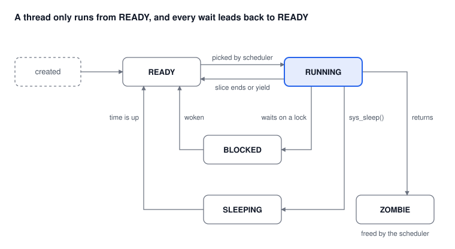

# Learning Operating Systems with picoOS

Jeff Curless · October 2026 · local copy of the [online edition](https://claude.ai/code/artifact/dac58cfd-0013-4df3-931a-9dfa92107735)

<!-- toc:start -->

## Contents

- [Preface](#ch-p)
    - [P.1 Who this book is for](#s-p-1)
    - [P.2 Why a small, imperfect OS](#s-p-2)
    - [P.3 How each chapter works](#s-p-3)
    - [P.4 Conventions](#s-p-4)
- [Chapter 1 — Getting Started](#ch-1)
    - [1.1 What you need](#s-1-1)
    - [1.2 Install the tools](#s-1-2)
    - [1.3 Build](#s-1-3)
    - [1.4 Flash](#s-1-4)
    - [1.5 Connect](#s-1-5)
    - [1.6 Try this](#s-1-6)
    - [1.7 Think about it](#s-1-7)
- [Chapter 2 — What Is an Operating System?](#ch-2)
    - [2.1 Life without an OS](#s-2-1)
    - [2.2 The four jobs of an operating system](#s-2-2)
    - [2.3 What picoOS leaves out](#s-2-3)
    - [2.4 A tour of the source tree](#s-2-4)
    - [2.5 Three words you will meet everywhere](#s-2-5)
    - [2.6 Try this](#s-2-6)
    - [2.7 Think about it](#s-2-7)
- [Chapter 3 — Booting: From Reset to the Scheduler](#ch-3)
    - [3.1 Before main()](#s-3-1)
    - [3.2 The boot sequence](#s-3-2)
    - [3.3 Creating a thread that has never run](#s-3-3)
    - [3.4 The jump that never returns](#s-3-4)
    - [3.5 Try this](#s-3-5)
    - [3.6 Think about it](#s-3-6)
- [Chapter 4 — Processes and Threads](#ch-4)
    - [4.1 What a thread really is](#s-4-1)
    - [4.2 What a process is](#s-4-2)
    - [4.3 Fixed tables instead of malloc](#s-4-3)
    - [4.4 Stack sizes and the canary](#s-4-4)
    - [4.5 Thread states](#s-4-5)
    - [4.6 Try this](#s-4-6)
    - [4.7 Think about it](#s-4-7)
- [Chapter 5 — Scheduling and Context Switching](#ch-5)
    - [5.1 Cooperative versus preemptive](#s-5-1)
    - [5.2 Priorities and ready queues](#s-5-2)
    - [5.3 The algorithm](#s-5-3)
    - [5.4 Why idle threads exist](#s-5-4)
    - [5.5 The context switch](#s-5-5)
    - [5.6 Sleeping](#s-5-6)
    - [5.7 Watching the scheduler](#s-5-7)
    - [5.8 Try this](#s-5-8)
    - [5.9 Think about it](#s-5-9)
- [Chapter 6 — Two Cores: Symmetric Multiprocessing](#ch-6)
    - [6.1 One scheduler, two cores](#s-6-1)
    - [6.2 Not quite symmetric](#s-6-2)
    - [6.3 Affinity](#s-6-3)
    - [6.4 The new danger](#s-6-4)
    - [6.5 Try this](#s-6-5)
    - [6.6 Think about it](#s-6-6)
- [Chapter 7 — Memory](#ch-7)
    - [7.1 Addresses: one big numbered list](#s-7-1)
    - [7.2 Execute in place (XIP)](#s-7-2)
    - [7.3 Where the SRAM goes](#s-7-3)
    - [7.4 Stacks](#s-7-4)
    - [7.5 The heap and kmalloc](#s-7-5)
    - [7.6 Fragmentation](#s-7-6)
    - [7.7 Better allocators](#s-7-7)
    - [7.8 Two cores, one heap](#s-7-8)
    - [7.9 Try this](#s-7-9)
    - [7.10 Think about it](#s-7-10)
- [Chapter 8 — Concurrency and Locks](#ch-8)
    - [8.1 A race in one line of C](#s-8-1)
    - [8.2 Why turning off interrupts is not enough](#s-8-2)
    - [8.3 Hardware spinlocks](#s-8-3)
    - [8.4 The kernel spinlock: spinlock\_t](#s-8-4)
    - [8.5 Blocking locks](#s-8-5)
    - [8.6 Semaphores](#s-8-6)
    - [8.7 Event flags](#s-8-7)
    - [8.8 Sharing hardware locks: the stripe pool](#s-8-8)
    - [8.9 Deadlock](#s-8-9)
    - [8.10 Priority inversion](#s-8-10)
    - [8.11 Known sharp edges](#s-8-11)
    - [8.12 Try this](#s-8-12)
    - [8.13 Think about it](#s-8-13)
- [Chapter 9 — Message Passing](#ch-9)
    - [9.1 The message queue](#s-9-1)
    - [9.2 Reading the producer and consumer](#s-9-2)
    - [9.3 Client and server](#s-9-3)
    - [9.4 Try this](#s-9-4)
    - [9.5 Think about it](#s-9-5)
- [Chapter 10 — System Calls](#ch-10)
    - [10.1 Why a doorway at all?](#s-10-1)
    - [10.2 The picoOS doorway](#s-10-2)
    - [10.3 What is missing](#s-10-3)
    - [10.4 The wider picoOS API](#s-10-4)
    - [10.5 Try this](#s-10-5)
    - [10.6 Think about it](#s-10-6)
- [Chapter 11 — Devices and the VFS](#ch-11)
    - [11.1 The device table](#s-11-1)
    - [11.2 ioctl: the escape hatch](#s-11-2)
    - [11.3 The VFS: one name space](#s-11-3)
    - [11.4 Try this](#s-11-4)
    - [11.5 Think about it](#s-11-5)
- [Chapter 12 — The Flash Filesystem](#ch-12)
    - [12.1 How flash behaves](#s-12-1)
    - [12.2 Layout](#s-12-2)
    - [12.3 Reading is free](#s-12-3)
    - [12.4 Writing is careful](#s-12-4)
    - [12.5 Stopping the world](#s-12-5)
    - [12.6 Concurrency](#s-12-6)
    - [12.7 What can go wrong](#s-12-7)
    - [12.8 Try this](#s-12-8)
    - [12.9 Think about it](#s-12-9)
- [Chapter 13 — The Shell](#ch-13)
    - [13.1 The read–parse–run loop](#s-13-1)
    - [13.2 Commands are data](#s-13-2)
    - [13.3 The commands](#s-13-3)
    - [13.4 config.txt](#s-13-4)
    - [13.5 Try this](#s-13-5)
    - [13.6 Think about it](#s-13-6)
- [Chapter 14 — Writing Your Own Application](#ch-14)
    - [14.1 The rules](#s-14-1)
    - [14.2 Step 1: write it](#s-14-2)
    - [14.3 Step 2: register it](#s-14-3)
    - [14.4 Step 3: build and run](#s-14-4)
    - [14.5 Common mistakes](#s-14-5)
    - [14.6 Think about it](#s-14-6)
- [Chapter 15 — Radios: WiFi, Bluetooth and the Triple Buffer](#ch-15)
    - [15.1 Who runs the radio code](#s-15-1)
    - [15.2 The shared-buffer trap](#s-15-2)
    - [15.3 The triple buffer](#s-15-3)
    - [15.4 Two locks, and why](#s-15-4)
    - [15.5 Testing a race on purpose](#s-15-5)
    - [15.6 Try this (W boards)](#s-15-6)
    - [15.7 Think about it](#s-15-7)
- [Chapter 16 — The Imperfections: Projects for the Reader](#ch-16)
    - [16.1 How to approach a project](#s-16-1)
    - [16.2 The projects](#s-16-2)
    - [16.3 A last word](#s-16-3)
- [Appendix — Glossary and Quick Reference](#ch-a)
    - [A.1 Glossary](#s-a-1)
    - [A.2 Limits](#s-a-2)
    - [A.3 Where to look](#s-a-3)
- [Index](#index)

<!-- toc:end -->

<a id="ch-p"></a>
## Preface

This book teaches how an operating system works by taking one apart: picoOS, a small dual-core OS for the Raspberry Pi Pico that fits in about 12,000 lines of C and one short file of assembly. Every idea in the book is something you can read in the source, run on a $5 board, and break on purpose.

<a id="s-p-1"></a>
### P.1 Who this book is for

You should be comfortable with C: pointers, structs, and the difference between the stack and a `malloc`. You do not need to have written a kernel, used an RTOS, or read ARM assembly. Advanced high-school students, first- and second-year university students, and teachers running a lab course are the intended readers.

<a id="s-p-2"></a>
### P.2 Why a small, imperfect OS

Real operating systems are too big to hold in your head. Linux's scheduler alone is larger than all of picoOS. A small system lets you follow a thread from creation to death without losing the trail.

picoOS is also **deliberately imperfect**. Its heap fragments, its scheduler scans queues one by one, and it trusts every pointer a program hands it. These are not oversights. Each one is a place where you can measure the cost of a simple design, then replace it with a better one. Chapter 16 collects them as projects.

<a id="s-p-3"></a>
### P.3 How each chapter works

Every chapter follows the same pattern:

1. **The question.** What problem does this part of the OS solve?
2. **The concept.** The general idea, as you would find it in any OS textbook.
3. **The picoOS answer.** The actual code, with file names so you can open it.
4. **Try this.** Commands to type at the picoOS shell to see the idea in action.
5. **Think about it.** Questions with no single right answer.

Keep a Pico plugged in and a terminal open while you read. An operating system is much easier to understand when you can poke it.

<a id="s-p-4"></a>
### P.4 Conventions

- `kmalloc()` — a function in the source. File references look like `src/kernel/mem.c`.
- `pico> mem` — a command typed at the picoOS shell.
- `$ ./build pico` — a command typed on your computer.
- **RP2040** means the original Pico and Pico W; **RP2350** means the Pico 2 and Pico 2 W.

This edition describes picoOS v0.3.9.

<a id="ch-1"></a>
## Chapter 1 — Getting Started

By the end of this chapter you will have picoOS running on a Pico and a shell prompt on your computer. It takes about 30 minutes the first time, most of it downloading the toolchain.

<a id="s-1-1"></a>
### 1.1 What you need

| Item | Notes |
| --- | --- |
| A Raspberry Pi Pico, Pico W, Pico 2 or Pico 2 W | Any of the four works. The W boards add WiFi and Bluetooth (Chapter 15). |
| A micro-USB cable that carries data | Many cheap cables carry power only. If the Pico never shows up, try another cable. |
| A Linux, macOS or Windows (WSL2) computer | Builds and talks to the Pico over USB. |
| Optional: Pimoroni Display Pack or Display Pack 2 | A small screen, four buttons and an RGB LED. |

The four boards use two different chips:

| Board | Chip | CPU cores | SRAM | Flash |
| --- | --- | --- | --- | --- |
| pico, picow | RP2040 | 2 × Cortex-M0+ | 264 KB | 2 MB |
| pico2, pico2w | RP2350 | 2 × Cortex-M33 | 520 KB | 4 MB |

That is the whole computer. There is no disk, no memory management unit and no operating system until you put one there.

<a id="s-1-2"></a>
### 1.2 Install the tools

On Debian, Ubuntu or Raspberry Pi OS:

```bash
sudo apt install cmake gcc-arm-none-eabi libnewlib-arm-none-eabi \
    libstdc++-arm-none-eabi-newlib build-essential python3 git
git clone https://github.com/raspberrypi/pico-sdk.git ~/pico-sdk
cd ~/pico-sdk && git submodule update --init --recursive
export PICO_SDK_PATH="$HOME/pico-sdk"
pip install pyserial
```

`gcc-arm-none-eabi` is a **cross-compiler**: it runs on your computer but produces code for the ARM chip on the Pico. The **Pico SDK** is Raspberry Pi's library for talking to the chip's hardware. picoOS is built on top of it.

<a id="s-1-3"></a>
### 1.3 Build

From the picoOS directory:

```bash
./build pico        # builds pico and picow images
./build pico2       # builds pico2 and pico2w images
./build             # builds all 12 variants
```

`build` is a script, not a folder. Never delete it. Each board is compiled in its own `build_<board>_<variant>/` directory, and the finished images are copied to `kits/`. A file name such as `picoos_D-v0.3.9.uf2` means: pico board, Display Pack build (`_D`), version 0.3.9. `_D2` means Display Pack 2; no suffix means no display.

<a id="s-1-4"></a>
### 1.4 Flash

1. Hold the **BOOTSEL** button on the Pico.
2. Plug in the USB cable, then release the button.
3. A drive called **RPI-RP2** (or **RP2350**) appears.
4. Copy the `.uf2` file onto it. The Pico reboots into picoOS.

Once picoOS is running you never need the button again: the shell command `update` reboots the Pico into BOOTSEL mode for you.

<a id="s-1-5"></a>
### 1.5 Connect

```bash
python3 tools/console.py
```

The script finds the Pico by its USB ID. You should see a banner like this:

```
=======================================================
picoOS  v0.3.9

  Platform : RP2040, dual ARM Cortex-M0+ (133 MHz max)
  Options  : DISPLAY_PACK
=======================================================

Threads created:
  TID 1  PID 1  pri 7  idle
  TID 2  PID 1  pri 7  idle1
  TID 3  PID 2  pri 2  shell

Starting scheduler...

pico>
```

The very first boot takes a little longer because picoOS formats its filesystem.

<a id="s-1-6"></a>
### 1.6 Try this

- `pico> help` lists every command.
- `pico> info` shows the chip, the version and how many hardware locks are in use.
- `pico> threads` shows the three threads in the banner, plus their state and CPU time.
- `pico> run pi` starts a program that estimates π on both cores. Run `threads` again while it works.

<a id="s-1-7"></a>
### 1.7 Think about it

The banner lists three threads before you have run anything. Two are called `idle`. Why would an operating system need a thread whose job is to do nothing? Chapter 5 answers this.

<a id="ch-2"></a>
## Chapter 2 — What Is an Operating System?

An operating system is the program that lets many other programs share one computer without knowing about each other. picoOS does this for a board with two CPU cores and 264 KB of memory.

<a id="s-2-1"></a>
### 2.1 Life without an OS

The usual first Pico program blinks an LED:

```c
int main(void) {
    gpio_init(25);
    gpio_set_dir(25, GPIO_OUT);
    for (;;) {
        gpio_put(25, 1); sleep_ms(500);
        gpio_put(25, 0); sleep_ms(500);
    }
}
```

This works, but the CPU spends 99.9% of its time inside `sleep_ms()` doing nothing. Now add a second job: read a temperature sensor every 2 seconds and answer typed commands over USB. You end up writing one giant loop that checks the clock, polls the keyboard and juggles all three jobs by hand. Every new job makes the loop harder to read and easier to break.

An operating system removes that loop. Each job becomes its own small program that looks as if it owns the CPU. The OS switches between them so quickly that they appear to run at the same time.

<a id="s-2-2"></a>
### 2.2 The four jobs of an operating system

| Job | The question it answers | Where it lives in picoOS |
| --- | --- | --- |
| **Share the CPU** | Who runs next, and for how long? | `sched.c`, `sched_asm.S`, `task.c` |
| **Share memory** | Who owns which bytes? | `mem.c`, thread stacks in `task.c` |
| **Coordinate** | How do programs wait for each other without corrupting shared data? | `sync.c` |
| **Hide the hardware** | How does a program read a file or a timer without knowing how flash or timers work? | `dev.c`, `vfs.c`, `fs.c`, `wifi.c`, `bluetooth.c` |

The rest of this book takes those four jobs in that order.

<a id="s-2-3"></a>
### 2.3 What picoOS leaves out

A desktop OS also **protects** programs from each other. It uses a memory management unit (MMU) so a bug in one program cannot overwrite another. The Pico has no MMU. The RP2350 has a simpler memory protection unit (MPU), but picoOS does not use it.

In picoOS a **process** is a bookkeeping idea, not a wall. Any thread can read or write any byte of memory. A wild pointer in your app can crash the kernel. Keep this in mind: it is the single biggest difference between picoOS and Linux, and it makes picoOS much easier to read.

<a id="s-2-4"></a>
### 2.4 A tour of the source tree

```
src/
├── main.c           boot sequence
├── kernel/          the operating system proper
├── drivers/         display and LED for the Display Pack
├── shell/           the command line you type into
└── apps/            programs that run on top: producer, consumer, sensor, pi, …
```

The kernel is layered. Apps call picoOS functions such as `sys_sleep()` and `vfs_open()`. The kernel calls the Pico SDK. The SDK pokes the hardware registers. One rule keeps the layers honest: **apps never call the Pico SDK directly.** An app uses `sys_sleep()`, never `sleep_ms()`, and `shell_print()`, never `printf()`. If an app needs something the kernel does not offer, you add a small kernel function first.

<a id="s-2-5"></a>
### 2.5 Three words you will meet everywhere

- **Thread** — one stream of instructions with its own stack. This is what the CPU actually runs.
- **Process** — a container that owns one or more threads, plus their open files. It has a number, the PID.
- **Kernel** — the code that creates threads, picks which one runs, and owns the shared tables. In picoOS the kernel is ordinary C functions that threads call directly.

<a id="s-2-6"></a>
### 2.6 Try this

- `pico> ps` lists processes. `pico> threads` lists threads. Compare the two lists: which process owns `idle`?
- `pico> run producer` then `pico> run consumer`. Two independent programs now pass messages to each other while you keep typing.

<a id="s-2-7"></a>
### 2.7 Think about it

If any thread can write to any address, what stops a buggy app from corrupting the scheduler's tables? (Nothing does. What would you need to add?)

<a id="ch-3"></a>
## Chapter 3 — Booting: From Reset to the Scheduler

Booting is the moment the computer turns from one plain program into many threads. In picoOS that happens in one function, `main()` in `src/main.c`, and the last line it runs, `sched_start()`, never returns.

<a id="s-3-1"></a>
### 3.1 Before main()

When power arrives, a small ROM inside the chip starts first. It finds your program in external flash, sets up the memory, and jumps to the SDK's start-up code. That code clears global variables, starts the system clock, and calls `main()`. At this moment only **core 0** is running. Core 1 is asleep, waiting to be told where to start.

<a id="s-3-2"></a>
### 3.2 The boot sequence

`main()` does nine things, in an order that matters:

1. **Start USB.** `stdio_usb_init()` makes the Pico appear as a serial port. picoOS then waits up to 3 seconds for your terminal to connect, so you do not miss the banner.
2. **Print the banner** with the version and the compiled-in options.
3. **Wake core 1.** `multicore_launch_core1(core1_entry)` starts the second core. Core 1 registers itself as a *lockout victim* (it agrees to pause when core 0 writes flash, Chapter 12) and sets the flag `core1_lockout_ready`. Core 0 spins until it sees that flag.
4. **Initialise the kernel, in dependency order:** `kmem_init()` (the heap), `sync_init()` (locks), `task_init()` (thread and process tables), `dev_init()` (devices), `vfs_init()` (file names), `fs_init()` (the flash filesystem, formatted on first boot).
5. **Create the kernel process**, PID 1.
6. **Start the radio** on W boards: `wifi_init()` and then `bt_init()`.
7. **Create the two idle threads**, `idle` pinned to core 0 and `idle1` pinned to core 1, both at the lowest priority, 7.
8. **Create the shell process**, PID 2, and its `shell` thread at priority 2.
9. **Start the scheduler.** `sched_init()` sets interrupt priorities; `sched_start()` jumps into the first thread.

Why this order? Every step uses the ones before it. Creating a thread calls `kmalloc()` for its stack, so the heap must exist first. `fs_init()` may erase flash, and `flash_safe_execute()` refuses to erase while core 1 is running but not yet registered as a lockout victim. So core 1 is started, and core 0 waits for it to register, before the filesystem is touched.

<a id="s-3-3"></a>
### 3.3 Creating a thread that has never run

Here is a puzzle. The scheduler starts a thread by *restoring* its saved registers. But a brand-new thread has never run, so it has nothing saved. How do you restore a thread that was never interrupted?

You fake it. `task_create_thread()` in `src/kernel/task.c` writes a pretend saved state onto the top of the new stack, exactly as if the thread had been interrupted just before its first instruction:

```
high address  (stack_base + stack_size)
  xpsr  = 0x01000000   Thumb bit: the CPU must run in Thumb mode
  pc    = entry        where the thread will start
  lr    = thread_exit  where it goes if entry() returns
  r12, r3, r2, r1 = 0
  r0    = arg          the first argument to entry()
  r11 … r4 = 0         <- saved_sp points here
  … free stack …
  0xDEADBEEF           <- canary at stack_base
low address
```

When the scheduler "restores" this thread, the CPU loads `pc = entry` and `r0 = arg`. The thread starts inside its entry function with its argument in hand. If the function ever returns, the link register sends it to `thread_exit()`, which cleans it up. The trick of building a fake interrupt frame is used by almost every OS kernel ever written.

<a id="s-3-4"></a>
### 3.4 The jump that never returns

`sched_start()` picks the highest-priority thread allowed on core 0, which is the shell. It then does three things you cannot do in an ordinary program:

- Sets the **process stack pointer (PSP)** to the shell's fake frame and tells the CPU to use PSP from now on. Interrupt handlers keep using the separate **main stack pointer (MSP)**. From here on, every thread has its own stack and the kernel's interrupt code has its own.
- Starts **SysTick**, a timer built into each core that fires every 1 ms.
- Enables interrupts and calls the shell's entry function directly.

The code comments warn: do not call any C function between switching to PSP and calling `entry()`. The compiler might save a local variable on the new stack and overwrite the fake frame. This is the kind of bug that only appears in kernels.

Meanwhile core 1 has been spinning on `current_tcb[0] == NULL`. As soon as core 0 picks its first thread, core 1 runs `sched_start_core1()`, which does the same steps for core 1. Both cores are now scheduling.

<a id="s-3-5"></a>
### 3.5 Try this

- Reboot (`pico> reboot`) and watch the banner. On a W board, the thread list starts with `wifi-poll`.
- In `src/main.c`, move `fs_init()` above `multicore_launch_core1()`. Predict what happens on a brand-new Pico, where `fs_init()` must format the flash. (Hint: core 1 is not running yet, so nothing can be locked out. Read what `flash_safe_execute()` does when the other core is not a lockout victim, then watch for `[fs] flash operation failed`.) Then put it back.

<a id="s-3-6"></a>
### 3.6 Think about it

The shell has priority 2 and the idle threads have priority 7. If the shell thread ran forever without ever waiting, what would the idle threads get? What would happen to USB, which core 0's idle thread services?

<a id="ch-4"></a>
## Chapter 4 — Processes and Threads

A thread is the thing the CPU runs; a process is the thing that owns threads. picoOS keeps up to 16 threads and 8 processes in two fixed tables, and every one of them is described by a small C struct you can read in `src/kernel/task.h`.

<a id="s-4-1"></a>
### 4.1 What a thread really is

Strip away the vocabulary and a thread is three things:

1. **A stack** — private memory for its local variables and function calls.
2. **A set of saved registers** — where it was and what it was holding the last time it was stopped.
3. **A record in the kernel** — its name, priority and state.

The CPU has only one set of registers per core. Running many threads means saving one thread's registers, loading another's, and keeping the record of who is where. That record is the **thread control block (TCB)**:

```c
typedef struct tcb {
    uint32_t        tid;          /* thread ID                         */
    uint32_t        pid;          /* owning process                    */
    uint8_t        *stack_base;   /* lowest byte of the stack          */
    uint32_t        stack_size;
    uint32_t       *saved_sp;     /* where the registers were saved    */
    uint32_t        exc_return;   /* how to return from the interrupt  */
    uint8_t         priority;     /* 0 = most urgent, 7 = least        */
    int8_t          affinity;     /* core 0, core 1, or either (-1)    */
    thread_state_t  state;
    uint64_t        wake_time_us; /* when a sleeper should wake        */
    uint64_t        cpu_time_us;  /* CPU time used so far              */
    char            name[16];
    struct tcb     *next;         /* link in a ready or waiter list    */
} tcb_t;
```

The first six fields are in a fixed order because the assembly language context switch reads `saved_sp` at byte offset 16 and `exc_return` at offset 20. Moving a field breaks the switch. `task.c` contains `_Static_assert` checks so the compiler catches it if you try.

Notice what is *not* in the TCB: the registers themselves. They are pushed onto the thread's own stack, and the TCB keeps only a pointer to them. That keeps every TCB the same small size.

<a id="s-4-2"></a>
### 4.2 What a process is

The **process control block (PCB)** groups threads together:

```c
typedef struct pcb {
    uint32_t  pid, parent_pid;
    char      name[16];
    tcb_t    *threads[MAX_THREADS];
    uint32_t  thread_count;
    int       fd_table[MAX_FDS];   /* open files */
    …
    bool      alive;
} pcb_t;
```

On Linux a process also owns a private address space. On picoOS it does not — all threads share all memory (Chapter 2). A picoOS process is a **unit of cleanup**: `killproc 101` stops every thread the process owns and frees them together.

picoOS hands out PIDs by range, so you can tell where a process came from by its number:

| PID | Who |
| --- | --- |
| 1 | the kernel process: idle threads, `wifi-poll` |
| 2 | the shell |
| 50+ | an app started by `AUTORUN=` in `config.txt` |
| 100+ | an app started with `run` |
| 200+ | an app started by a Display Pack button |

<a id="s-4-3"></a>
### 4.3 Fixed tables instead of malloc

TCBs and PCBs live in two static arrays, `tcb_pool[16]` and `pcb_pool[8]`. Creating a thread scans for a free slot. Only the stack comes from the heap. This is a common embedded design: the kernel's bookkeeping can never fail for lack of heap, and you can see the whole table in a debugger. The price is a hard limit. Try to start a 17th thread and `task_create_thread()` returns `NULL`.

<a id="s-4-4"></a>
### 4.4 Stack sizes and the canary

A thread's stack is fixed when it is created:

| Constant | Size | Used for |
| --- | --- | --- |
| `IDLE_STACK_SIZE` | 512 B | idle threads, which call almost nothing |
| `DEFAULT_STACK_SIZE` | 2 KB | the shell and apps |
| `DEEP_STACK_SIZE` | 3 KB | threads with deep call chains |

The stack cannot grow. If a thread uses more than its share, it silently writes over whatever sits below it in memory — usually another thread's stack or a heap block. To catch this, picoOS writes the value `0xDEADBEEF` (the **canary**) at the lowest word of every stack. On every context switch the scheduler checks it. If it has changed, the thread overflowed, and picoOS prints `!!! STACK OVERFLOW !!!` with the thread's name and halts.

The name comes from coal miners, who carried a canary underground: if the bird stopped singing, the air was bad. The check is cheap but late — it only notices damage after it has happened, and only if the overflow happened to change that exact word.

<a id="s-4-5"></a>
### 4.5 Thread states

Every thread is in exactly one state:

| State | Meaning |
| --- | --- |
| NEW | being created (picoOS goes straight to READY) |
| READY | could run; waiting in a ready queue for a core |
| RUNNING | on a core right now; at most two threads at once |
| BLOCKED | waiting for a lock, semaphore, event or message |
| SLEEPING | waiting for a time, set by `sys_sleep()` |
| ZOMBIE | finished; waiting for its stack and TCB to be freed |



A thread runs only after the scheduler picks it from READY; blocking, sleeping and slice expiry all return it there, and only a finished thread leaves the cycle.

A thread cannot free its own stack while it is still standing on it. So a finished thread only marks itself ZOMBIE and yields. The next time the scheduler runs, on a different stack, it frees the zombie's memory. This is called **reaping**.

`kill` follows the same rule. A thread that is READY or SLEEPING is freed at once. A thread running on the other core is only marked, and is reaped when that core next switches away from it. A thread waiting on a lock stays in the lock's waiter list as a ZOMBIE until the lock wakes it (Chapter 8).

<a id="s-4-6"></a>
### 4.6 Try this

- `pico> run sensor`, then `pico> threads`. Find its TID, PID, priority and state.
- `pico> kill <tid>` removes one thread; `pico> killproc <pid>` removes a whole process.
- The `threads` command has a `CANARY` column. Find it in `cmd_threads()` in `src/shell/shell.c` and work out what it prints.

<a id="s-4-7"></a>
### 4.7 Think about it

1. Why is the canary at the *lowest* address of the stack and not the highest?
2. What goes wrong if you kill a thread while it holds a mutex? (Chapter 8 returns to this.)

<a id="ch-5"></a>
## Chapter 5 — Scheduling and Context Switching

The scheduler answers one question, over and over: which thread runs next? picoOS answers with **preemptive priority round-robin**: the most urgent ready thread always wins, threads of equal urgency take turns, and nobody gets more than 10 ms at a time.

<a id="s-5-1"></a>
### 5.1 Cooperative versus preemptive

There are two ways to take the CPU away from a thread.

- **Cooperative:** the thread gives it up voluntarily, by calling `sys_yield()`, `sys_sleep()` or a blocking call. Simple, but one thread stuck in a `while (1)` freezes the whole system.
- **Preemptive:** a timer interrupt takes the CPU away whether the thread likes it or not.

picoOS does both. Threads can yield, and a 1 ms **SysTick** interrupt on each core also counts down a time slice. When the slice reaches zero, the thread is switched out.

<a id="s-5-2"></a>
### 5.2 Priorities and ready queues

Priorities run from 0 (most urgent) to 7 (least). The scheduler keeps one linked list per priority, `ready_queues[8]` in `src/kernel/sched.c`. A thread that can run sits in the list for its priority, linked through the `next` field of its TCB.

| Priority | Typical thread |
| --- | --- |
| 2 | the shell |
| 6 | `wifi-poll` (W boards) |
| 7 | `idle`, `idle1` |

Apps choose their own priority in `app_table[]`.

<a id="s-5-3"></a>
### 5.3 The algorithm

`sched_next_thread()` is called on every switch. In plain words:

1. Check the outgoing thread's stack canary (Chapter 4).
2. If the outgoing thread was RUNNING, mark it READY again.
3. If it was a ZOMBIE, free it.
4. For priority 0, then 1, then 2 … up to 7:
   1. If the outgoing thread is at the head of this queue, move it to the tail. This is the **round-robin** step: equals take turns.
   2. Walk the queue and take the first READY thread whose affinity allows this core and that is not still running on the other core. Chapter 8 explains why a READY thread can still be running.
5. Mark the chosen thread RUNNING and give it a fresh 10 ms slice.

Because idle threads are always READY at priority 7, step 4 always finds something.

This is **strict priority**: a priority-3 thread never runs while a priority-2 thread is ready. If a high-priority thread never waits, every lower one **starves**. That is why the shell polls for keystrokes with a 1 ms sleep rather than a busy loop — the comment in `shell_run()` says so.

<a id="s-5-4"></a>
### 5.4 Why idle threads exist

The CPU cannot "run nothing". It must always be executing some instruction. The idle thread gives it something harmless to do: execute `__wfi()` (wait for interrupt), which stops the core until the next interrupt arrives, saving power. Core 0's idle thread also services USB after each wake-up, as a backstop: `dev_console_poll()` runs TinyUSB's `tud_task()` when it has work waiting. It goes through the SDK's USB lock, because the shell and every `printf` also service USB, from either core, and TinyUSB must never run on both cores at once. On the RP2040 the SDK's USB interrupt does that work anyway; on the RP2350 the idle call matters more. So if the shell or an app hogs core 0 at a higher priority, the idle thread never runs and USB depends on the SDK's interrupt alone — the answer to Chapter 3's question.

<a id="s-5-5"></a>
### 5.5 The context switch

Switching threads means saving every register of the old thread and loading every register of the new one. C cannot name registers, so this one job is done in assembly, in `isr_pendsv` in `src/kernel/sched_asm.S`.

The switch runs inside **PendSV**, an interrupt that software can request by setting a bit:

```c
void sched_yield(void) {
    SCB->ICSR |= SCB_ICSR_PENDSVSET_Msk;   /* "please switch soon" */
}
```

PendSV is given the lowest interrupt priority. It waits until every other interrupt has finished, so a context switch never happens in the middle of a USB or timer handler. SysTick requests PendSV when a slice ends. A thread that sleeps or blocks requests it by calling `sched_yield()`.

When PendSV fires, the hardware has already pushed eight registers (r0–r3, r12, lr, pc, xPSR) onto the thread's stack. The handler does the rest:

1. Disable interrupts.
2. Push the other eight registers, r4–r11, onto the same stack.
3. Store the stack pointer in `current_tcb[core]->saved_sp` (byte offset 16).
4. Call `sched_next_thread()` to pick the next thread.
5. Load the new thread's `saved_sp` and pop r4–r11 from its stack.
6. Set the process stack pointer to the new stack and re-enable interrupts.
7. Return from the interrupt. The hardware pops the new thread's eight registers — including its `pc` — and the new thread carries on exactly where it stopped.

On the Cortex-M0+ (RP2040) step 2 is awkward. Its store-multiple instruction can only reach the low registers r0–r7, so r8–r11 are first copied into r4–r7 and stored in two batches. The Cortex-M33 (RP2350) does it in one instruction. Both versions sit side by side in the file, selected by `#if`.

The M33 has a floating-point unit. A thread that has used it gets a 26-word hardware frame instead of 8. The CPU says which by the value in the link register on entry, called **EXC\_RETURN**. picoOS saves that value per thread in `exc_return`, so it restores each thread with the right frame size.

<a id="s-5-6"></a>
### 5.6 Sleeping

`sys_sleep(ms)` records a wake time in the TCB, marks the thread SLEEPING, removes it from its ready queue and yields. Every millisecond core 0's SysTick handler walks all 16 TCB slots looking for sleepers whose time has come, marks them READY and puts them back in a queue.

One subtlety: a woken thread does not run immediately. It waits for the next switch, which may be up to 10 ms away unless it outranks the running thread. A sleep of 1 ms can therefore last longer than 1 ms. All general-purpose operating systems share this: a sleep means "at least this long".

<a id="s-5-7"></a>
### 5.7 Watching the scheduler

The `trace` command records what the scheduler does. `trace on` starts recording, and `trace show` prints the events, oldest first, timed from the first one. A name after `trace on` keeps only threads whose names start with it. The output looks like this (times and TIDs vary):

```
pico> trace on pi
Tracing threads named pi*.
pico> run pi
  ...
pico> trace show 4
      ms  core  event
   0.000  c0   pi-worker(6) -> pi-worker(8)  preempt/yield
   0.003  c1   pi-worker(7) -> pi-worker(9)  preempt/yield
  10.001  c0   pi-worker(8) -> pi-worker(6)  preempt/yield
  10.004  c1   pi-worker(9) -> pi-worker(7)  preempt/yield
```

A switch line says why the outgoing thread left the CPU: `preempt/yield` (it could still run: its slice ended or it yielded), `sleep`, `block` or `exit`. The other events are `wake` (SysTick woke a sleeper), `unblock` (a mutex, semaphore or queue woke a waiter) and `kill`.

The recorder is a **ring buffer** of the last 128 events, like an aircraft's flight recorder: when it is full, each new event overwrites the oldest. The scheduler records an event inside PendSV or SysTick, so it must not print there. Printing waits on USB, and an interrupt handler that waits stalls its core. It only copies the event into the ring, and the shell prints it later from an ordinary thread. The ring is guarded by the scheduler lock, which every writer already holds, so tracing needs no hardware lock of its own. Each event keeps a copy of the thread names, because a thread may have exited before you print.

Without a name filter the ring fills fast. The shell checks for a key press every millisecond, and each check adds a wake and two switches, so 128 events cover only about 40 ms.

<a id="s-5-8"></a>
### 5.8 Try this

- `pico> run pi` and watch `threads`. The `Time` column shows CPU time per thread; `CORE` shows where each one is.
- Change `TIME_SLICE_MS` in `sched.c` from 10 to 1 and to 100. Run `pi` again and compare how responsive the shell feels.
- Write an app at priority 1 that loops forever without sleeping. What happens to the shell? To USB?
- `pico> trace on shell`, type a few characters, then `trace show`. Find the shell's one-millisecond sleep, and the switch to `idle` that follows each one.

<a id="s-5-9"></a>
### 5.9 Think about it

1. The sleep scan looks at every TCB every millisecond, even if nobody is asleep. Design a sorted sleep list that only looks at the first entry.
2. Finding the highest non-empty queue means checking up to 8 lists. Many kernels keep an 8-bit mask with one bit per non-empty queue. How would you find the highest set bit in one instruction?
3. `trace` keeps only the last 128 events and prints them afterwards. How would you stream events to the console as they happen, without printing from an interrupt? What happens when events arrive faster than USB can send them?

<a id="ch-6"></a>
## Chapter 6 — Two Cores: Symmetric Multiprocessing

On one core, threads only *appear* to run at the same time. On two cores, two threads truly run at the same instant — and that changes the rules for every piece of shared data. picoOS is **symmetric**: both cores run the same scheduler code over the same ready queues.

<a id="s-6-1"></a>
### 6.1 One scheduler, two cores

Each core has its own:

- SysTick timer, ticking every 1 ms
- PendSV interrupt, for its own context switches
- idle thread (`idle` on core 0, `idle1` on core 1)
- entry in `current_tcb[2]`, the thread it is running right now

The cores share everything else: the ready queues, the TCB and PCB tables, the heap and the filesystem. When core 1's time slice ends, it runs exactly the same `sched_next_thread()` that core 0 runs, and picks from the same lists.

The code asks "which core am I?" by reading a hardware register, `get_core_num()`. The macro `CURRENT_TCB` expands to `current_tcb[get_core_num()]`, so the same line of C means "my thread" on whichever core runs it.

<a id="s-6-2"></a>
### 6.2 Not quite symmetric

Some work happens only on core 0:

| Job | Why core 0 |
| --- | --- |
| USB (`dev_console_poll()` in `idle`) | the USB interrupt is wired to core 0 |
| the global tick count and waking sleepers | doing it on both cores would wake every sleeper twice |
| WiFi and Bluetooth callbacks | the radio's interrupt runs on core 0 |
| writing flash | core 0 pauses core 1 while it erases (Chapter 12) |

<a id="s-6-3"></a>
### 6.3 Affinity

Every TCB has an `affinity` field: `THREAD_AFFINITY_C0`, `THREAD_AFFINITY_C1`, or `THREAD_AFFINITY_ANY`. The scheduler skips a thread whose affinity does not match the core asking. New threads default to ANY. The idle threads are pinned, one per core, so each core always has something to run.

The `pi` app shows why affinity matters. It starts four worker threads that each throw 2.5 million random darts at a square and count how many land inside a circle. `run pi` pins two workers to each core. `run pi single` pins all four to core 0. Compare the `elapsed` line the two runs print.

<a id="s-6-4"></a>
### 6.4 The new danger

On one core, a thread can make a short piece of code safe by turning interrupts off: no interrupt means no context switch, so nothing else can run. On two cores that trick stops working. Turning off interrupts on core 0 does nothing to core 1, which keeps running.

Suppose both cores finish a time slice at the same moment and both walk `ready_queues[2]`. Both could pick the same thread and run it twice, on two stacks that are really one stack. The result is corruption that appears once a week and never in a debugger.

The fix is a lock that works across cores. The scheduler holds `sched_lock` whenever it reads or changes the ready queues. Building such a lock needs help from the hardware, which is where Chapter 8 begins.

<a id="s-6-5"></a>
### 6.5 Try this

- `pico> run pi` and note `elapsed`. Then `pico> run pi single`. Is dual-core twice as fast? Why not exactly?
- During a run, `pico> threads` shows the `CORE` column. Do the workers ever move?

<a id="s-6-6"></a>
### 6.6 Think about it

1. Core 1 has no USB to service. What does its idle thread do all day?
2. When a thread on core 0 wakes a thread pinned to core 1, nothing tells core 1 to switch right away. How long can the woken thread wait? How could you shorten that? (Search for "inter-processor interrupt".)

<a id="ch-7"></a>
## Chapter 7 — Memory

The Pico has two kinds of memory, and an operating system must manage both: a small, fast **SRAM** that is wiped at every reset, and a larger, slower **flash** that keeps its contents with the power off. picoOS runs its code from flash, keeps its data in SRAM, and carves 64 KB of the SRAM into a heap that every thread stack and dynamic object comes from.

<a id="s-7-1"></a>
### 7.1 Addresses: one big numbered list

To the CPU, all memory is one long row of bytes, each with a 32-bit address. Different ranges of addresses lead to different hardware:

| Address range | What is there | Size (RP2040) |
| --- | --- | --- |
| `0x0000_0000` | boot ROM, fixed in the chip | 16 KB |
| `0x1000_0000` | external flash, read through XIP | 2 MB |
| `0x2000_0000` | SRAM | 264 KB |
| `0x4000_0000` and up | hardware registers: GPIO, timers, USB, … | — |
| `0xD000_0000` | SIO: core ID, hardware spinlocks, FIFOs | — |

That last row explains a line in `sched_asm.S`: `ldr r2, =0xD0000000` then `ldr r2, [r2]`. Reading the word at that address returns 0 on core 0 and 1 on core 1. A hardware register looks exactly like memory.

<a id="s-7-2"></a>
### 7.2 Execute in place (XIP)

Your compiled program lives in flash at `0x1000_0000`. The chip can run it straight from there, a feature called **execute in place**. A 16 KB cache in front of the flash hides most of the delay. Constant data marked `const` stays in flash too. Only variables are copied into SRAM at start-up.

XIP has one sharp edge. While flash is being erased or written, it cannot be read — and that means no code can be fetched from it. Chapter 12 shows how picoOS survives this.

<a id="s-7-3"></a>
### 7.3 Where the SRAM goes

On a pico with a Display Pack, the build's linker map (read with `tools/mem_report.py`) shows roughly:

| Region | Size |
| --- | --- |
| Kernel heap: thread stacks + dynamic objects | 64 KB |
| Display framebuffer | \~32 KB |
| Filesystem buffers | \~6 KB |
| TCB/PCB tables, VFS tables, other globals | \~10 KB |
| Pico SDK | \~6 KB |
| Free | \~146 KB |

The C compiler puts every variable in one of four places:

- **.data** — globals with a starting value. Copied from flash to SRAM at boot.
- **.bss** — globals with no starting value. Zeroed at boot. The 64 KB heap array is here: `static uint8_t heap_memory[HEAP_SIZE];`
- **the stack** — local variables, one stack per thread.
- **the heap** — memory requested at run time with `kmalloc()`.

The first two are fixed by the linker before the program ever runs. The last two change while it runs, and they are the operating system's problem.

<a id="s-7-4"></a>
### 7.4 Stacks

Every function call pushes a **stack frame**: the return address, saved registers and local variables. When the function returns, the frame is popped. On ARM the stack grows *down*, toward lower addresses.

Each picoOS thread has its own stack, allocated from the heap when the thread is created (512 B, 2 KB or 3 KB). Here is what fits in 2 KB: a context-switch frame (64 bytes), a few levels of function calls, and a local buffer or two. What does *not* fit:

```c
void my_app(void *arg) {
    char line[4096];     /* 4 KB on a 2 KB stack: overflow */
    …
}
```

That array runs straight past the bottom of the stack into the heap block below, and the canary check catches it at the next context switch — if you are lucky. Large buffers belong on the heap or in a `static` variable. Deep recursion is also dangerous: each call costs a frame, and there is nothing to stop it.

<a id="s-7-5"></a>
### 7.5 The heap and kmalloc

The heap is one 64 KB array divided into **blocks**. Each block starts with a small header:

```c
struct heap_block {
    uint32_t           size;   /* bytes in the payload, after the header */
    bool               free;
    struct heap_block *next;   /* next block in address order */
};
```

The header is 12 bytes on the Pico, rounded up to 16 so every payload starts on an 8-byte boundary. At boot the whole heap is one free block. The blocks always form a list in address order, from the start of the array to the end:

```
[hdr|free 65520 bytes                                           ]
```

`kmalloc(n)` in `src/kernel/mem.c`:

1. Round `n` up to a multiple of 8.
2. Walk the list from the start. Stop at the **first** free block big enough. This is the **first-fit** policy.
3. If the block is much bigger than needed (at least a header plus 32 bytes left over), **split** it: the front part is returned, the rest becomes a new free block.
4. Mark it used and return the address just after its header.

After three threads are created, the heap might look like this:

```
[hdr|A 2048][hdr|B 2048][hdr|C 2048][hdr|free 59328            ]
```

`kfree(p)` steps back 16 bytes from `p` to find the header, marks it free, and **coalesces**: it merges the block with any free neighbours so that two small holes become one large one. Merging forward is easy because each header points to the next. Merging backward needs the previous block, which the header does not record, so `kfree()` walks the list from the start to find it. That makes `kfree()` slower as the heap fills up.

The code comment calls this a "boundary-tag" allocator. A true boundary-tag allocator also puts a copy of the size at the *end* of each block, so the previous block can be found in one step. picoOS leaves that out to save 8 bytes per block. Adding it is a good exercise.

<a id="s-7-6"></a>
### 7.6 Fragmentation

Free B from the picture above:

```
[hdr|A 2048][hdr|free 2048][hdr|C 2048][hdr|free 59328         ]
```

Now allocate 32 bytes. First-fit takes them from the hole where B was, and splits it. Do this a few dozen times with mixed sizes and the heap fills with small holes between used blocks. The total free space can be large while the **largest free block** is too small for a new 2 KB stack. This is **external fragmentation**, and it is the main weakness of first-fit.

The `mem` command shows it directly:

```
pico> mem
Kernel heap:
  Used        : … bytes
  Free        : … bytes
  Largest free: … bytes
```

When "Free" is much larger than "Largest free", the heap is fragmented.

There is also **internal fragmentation**: memory wasted inside blocks. Ask for 1 byte and you use 8 bytes of payload plus a 16-byte header. Small allocations are expensive.

<a id="s-7-7"></a>
### 7.7 Better allocators

| Allocator | Idea | Trade-off |
| --- | --- | --- |
| First-fit (picoOS) | take the first hole that fits | simple; fragments the front of the heap |
| Best-fit | take the smallest hole that fits | fewer big holes wasted; must search the whole list |
| Buddy | sizes are powers of two; split and merge in pairs | fast merge, no external fragmentation; rounds 2,100 B up to 4 KB |
| Slab / pool | a separate pool for each fixed object size | no fragmentation for that size; only fits fixed sizes |

The TCB and PCB tables in Chapter 4 are already a simple pool allocator.

<a id="s-7-8"></a>
### 7.8 Two cores, one heap

Both cores call `kmalloc()`. If both walked and split the same free block at the same moment, two threads would get the same memory. So `kmalloc()` and `kfree()` hold `heap_lock`, a hardware spinlock, for the whole walk. Chapter 8 explains what that means.

<a id="s-7-9"></a>
### 7.9 Try this

- `pico> mem`, then `run producer`, `run consumer`, `run sensor`, and `mem` again. How much did each thread cost?
- Kill one in the middle (`kill <tid>`), start a different one, and look at "Largest free".
- Run the host tests with `./build tests`. Read `tests/mem/` to see a fragmentation test that needs no hardware.
- Run `python3 tools/mem_report.py build_pico_D/src/picoos_D-v0.3.9.elf.map` and find the 64 KB heap array.

<a id="s-7-10"></a>
### 7.10 Think about it

1. Every thread stack is 2 KB even if the thread uses 300 bytes. How could the OS measure how much of a stack is actually used? (Hint: fill it with a pattern at creation.)
2. The heap is 64 KB, but 146 KB of SRAM is unused. What would you change to give apps more heap, and what would you check first?

<a id="ch-8"></a>
## Chapter 8 — Concurrency and Locks

When two threads touch the same data, the result can depend on who got there first — a **race condition**. Locks prevent races by letting only one thread at a time into the code that touches shared data. picoOS builds every lock it has from two ingredients: a hardware spinlock in the chip, and the scheduler's ability to put a thread to sleep.

<a id="s-8-1"></a>
### 8.1 A race in one line of C

```c
static int counter = 0;

void worker(void *arg) {
    for (int i = 0; i < 100000; i++)
        counter++;
}
```

Start two workers and you expect 200,000. You will usually get less. `counter++` looks like one step but the CPU does three:

```
ldr  r1, [r0]     @ 1. read counter into a register
adds r1, r1, #1   @ 2. add one
str  r1, [r0]     @ 3. write it back
```

If thread A reads 41, then thread B reads 41, then both write 42, one increment is lost. On one core this needs an unlucky context switch between steps 1 and 3. On two cores it happens whenever both run the loop at once, which is all the time.

The three instructions form a **critical section**: code that must run start-to-finish without anyone else touching the same data. Every lock exists to protect a critical section. The property it gives you is **mutual exclusion**.

<a id="s-8-2"></a>
### 8.2 Why turning off interrupts is not enough

On a single core you can protect a critical section by disabling interrupts. No interrupt means no SysTick, no PendSV and no context switch. On two cores this only stops *your* core. Core 1 carries on and walks into the same critical section. You need something both cores can see.

<a id="s-8-3"></a>
### 8.3 Hardware spinlocks

What you need is one operation that **tests and sets** a value in a single, indivisible step. Most modern CPUs offer special instructions for this. The Cortex-M33 has them; the Cortex-M0+ in the RP2040 does not.

Raspberry Pi solved this in silicon. The SIO block at `0xD000_0000` holds 32 **spinlock registers**:

- **Read** one. If it returns non-zero, you now own the lock. If it returns zero, someone else holds it.
- **Write** any value to it to release the lock.

The read is the test-and-set. The hardware guarantees that if both cores read at the same instant, only one gets non-zero. To wait, a core just reads again and again — it **spins**. That is the whole primitive.

The hardware does not record *which* core holds the lock. If a core reads a lock it already holds, it gets zero and spins forever waiting for itself. Spinlocks cannot be nested on the same lock.

<a id="s-8-4"></a>
### 8.4 The kernel spinlock: spinlock\_t

`spinlock_t` in `src/kernel/sync.h` wraps one of those registers. The kernel almost always uses it like this:

```c
uint32_t saved = spinlock_irq_acquire(&heap_lock);  /* IRQs off, then spin */
/* … critical section: a few dozen instructions … */
spinlock_irq_release(&heap_lock, saved);            /* release, IRQs back */
```

It disables interrupts *and* takes the hardware lock. Both are needed:

- The hardware lock keeps the **other core** out.
- Disabling interrupts keeps **this core** from switching threads while it holds the lock. Without it, a thread could be preempted while holding the lock, and every other thread that wants it would spin uselessly for a whole time slice.

The rule for spinlocks: **hold them for microseconds, never across anything that waits.** Spinning wastes a whole core. picoOS uses dedicated spinlocks for just three hot structures: the ready queues (`sched_lock`), the heap (`heap_lock`) and a table of event waiters (`event_pool_lock`).

<a id="s-8-5"></a>
### 8.5 Blocking locks

For longer waits, a thread should **sleep**, not spin: leave the CPU so another thread can use it, and be woken when the lock is free. picoOS has four such primitives, all in `src/kernel/sync.c`:

| Primitive | Protects or signals | Key operations |
| --- | --- | --- |
| Mutex `kmutex_t` | one owner at a time | `kmutex_lock()`, `kmutex_unlock()` |
| Semaphore `ksemaphore_t` | a count of available things | `ksemaphore_wait()` (P), `ksemaphore_signal()` (V) |
| Event flags `event_flags_t` | up to 32 yes/no conditions | `event_flags_set()`, `event_flags_wait(mask, all)` |
| Message queue `mqueue_t` | a queue of up to 16 messages | `mqueue_send()`, `mqueue_recv()` (Chapter 9) |

Each one is a small struct of ordinary memory: some state, plus a list of waiting threads. A spinlock guards that memory for a few dozen cycles at a time. Here is the whole mutex lock:

```c
void kmutex_lock(kmutex_t *m) {
    while (1) {
        uint32_t irq = spinlock_irq_acquire(&m->spin);
        if (m->owner_tid == -1) {                       /* free: take it   */
            m->owner_tid = CURRENT_TCB->tid;
            spinlock_irq_release(&m->spin, irq);
            return;
        }
        waiter_enqueue(&m->waiters, CURRENT_TCB);       /* join the line   */
        sched_block(CURRENT_TCB);                       /* not READY now   */
        spinlock_irq_release(&m->spin, irq);
        sched_yield();                                  /* switch out      */
    }                                                   /* woken: try again */
}
```

Three details are worth slowing down for.

**Join the line before letting go.** The thread puts itself on the waiter list and marks itself BLOCKED *while still holding the spinlock*. If it released the spinlock first, the owner could unlock in that gap, find no waiters, and the thread would then sleep forever. That bug is called a **lost wake-up**, and it is the most common mistake in hand-made locks.

**A wake-up is a hint, not a gift.** `kmutex_unlock()` frees the mutex and wakes the first waiter. But by the time the waiter runs, a third thread may have taken the mutex. So the waiter loops back and checks again. Almost every OS works this way.

**The waiter list costs no memory.** A BLOCKED thread is in no ready queue, so its TCB's `next` field is free. The waiter list is threaded through that same field.

<a id="s-8-6"></a>
### 8.6 Semaphores

A semaphore is a counter that never goes below zero. `wait` takes one unit, sleeping if the count is 0. `signal` adds one unit and wakes a waiter. Start the count at the number of free slots in a buffer and it counts free slots. Start it at 0 and it becomes a signal: "something happened". The `producer` demo uses one for exactly that. The names P and V come from Edsger Dijkstra, who invented semaphores in the 1960s.

<a id="s-8-7"></a>
### 8.7 Event flags

Event flags are 32 bits that threads can set, clear and wait on. A thread can wait for **any** of several bits or for **all** of them. The WiFi code uses this to wake an app when a scan window is ready *or* when scanning has stopped (`CONT_EV_READY | CONT_EV_STOP`). Unlike a semaphore, setting a flag that is already set does nothing: flags remember *whether*, not *how many*.

<a id="s-8-8"></a>
### 8.8 Sharing hardware locks: the stripe pool

The RP2040 has only 32 spinlock registers, and the SDK reserves most of them. Early versions of picoOS gave every mutex its own register and halted silently after a handful. Today all blocking primitives share a pool of four, `prim_pool`, picked from the object's address:

```c
idx = (address >> 4) % 4;
```

You can now create as many mutexes as memory allows. The cost: two unrelated mutexes may share a register. That is harmless for the few cycles of a state update, but **a thread must never hold two primitives' spinlocks at once** — if they share a register, the core spins on itself forever. The shell's `info` command shows how many hardware locks are in use.

<a id="s-8-9"></a>
### 8.9 Deadlock

Thread A holds lock 1 and waits for lock 2. Thread B holds lock 2 and waits for lock 1. Neither will ever move. That is **deadlock**. It needs four conditions at once:

1. **Mutual exclusion** — a lock has one owner.
2. **Hold and wait** — a thread holds one lock while waiting for another.
3. **No preemption** — nobody can take a lock away.
4. **Circular wait** — A waits for B, B waits for A.

Break any one and deadlock cannot happen. The easiest to break is the fourth: always take locks in the same order. picoOS writes its order down in `docs/locking.md`:

```
primitive's stripe  ->  event_pool_lock  ->  sched_lock  ->  heap_lock
```

No code path takes them in the other direction.

picoOS also has a debugging aid. Build with `-DPICOOS_LOCK_DEBUG=ON` and every blocking lock records which file and line took it. If a thread stays BLOCKED longer than 5 seconds, the kernel halts and prints the waiting thread, the lock and where its holder took it.

<a id="s-8-10"></a>
### 8.10 Priority inversion

A high-priority thread H waits for a mutex held by low-priority thread L. A medium-priority thread M, which needs no lock at all, becomes ready. M outranks L, so L never runs, so L never releases the mutex, so H waits behind M — a thread it outranks. This is **priority inversion**. It famously reset the Mars Pathfinder lander in 1997.

The usual fix is **priority inheritance**: while L holds a mutex that H wants, L temporarily runs at H's priority. picoOS does not do this. It is one of the projects in Chapter 16.

<a id="s-8-11"></a>
### 8.11 Known sharp edges

picoOS's mutex is simple on purpose. Each of these is a deliberate teaching point:

- **Not recursive.** If a thread locks a mutex it already holds, it waits for itself forever.
- **No owner check on unlock.** Any thread can unlock any mutex.
- **Killing a lock holder.** `kill` removes a thread even if it holds a mutex. Nobody will ever unlock it, and every waiter blocks forever.
- **Killing a waiter.** A thread killed while it waits stays in the waiter list as a ZOMBIE. The lock frees it instead of waking it, and passes the wake-up on to the next waiter. If the lock is never released again, the zombie's memory is never freed.
- **A race that was real.** Between `spinlock_irq_release()` and the context switch in `kmutex_lock()`, the thread is still running on its core. If the other core woke it in that tiny window, the scheduler could start it on the second core while it was still on the first: two cores on one stack. `docs/locking.md` listed this as a suspected race, and it is now fixed. The scheduler records each core's running thread under `sched_lock`, and `sched_next_thread()` skips a READY thread that is still current on the other core. Note what the bug was: every step held the right lock, but READY did not mean "not running". A test that hammers one mutex from both cores is still worth writing.

<a id="s-8-12"></a>
### 8.12 Try this

- Write the two-worker `counter++` app above and run it. Print the total. Then protect the loop with a `kmutex_t` and run it again. Time both versions with `dev_ioctl(DEV_TIMER, IOCTL_TIMER_GET_US, …)`.
- Pin both workers to core 0 with affinity and run the unprotected version again. Do you still lose increments? Why fewer?
- Write two threads that take two mutexes in opposite orders, build with `PICOOS_LOCK_DEBUG=ON`, and read the report.

<a id="s-8-13"></a>
### 8.13 Think about it

1. Why does a spinlock make sense for the heap but a mutex for the filesystem?
2. A semaphore initialised to 1 behaves almost like a mutex. What is the difference?
3. Design `kmutex_t` with priority inheritance. Which fields do you need to add to the mutex and to the TCB?

<a id="ch-9"></a>
## Chapter 9 — Message Passing

Locks let threads share data safely; message passing lets them avoid sharing it at all. Instead of two threads reaching into one variable, one thread **copies** a value into a queue and the other copies it out. picoOS treats this as a first-class way to build programs.

<a id="s-9-1"></a>
### 9.1 The message queue

`mqueue_t` in `src/kernel/sync.h` is a **ring buffer** of 16 slots, each up to 64 bytes:

```c
typedef struct {
    spinlock_t  spin;
    uint8_t     buf[MQ_MAX_MSG][MQ_MSG_SIZE];   /* 16 × 64 bytes */
    uint32_t    msg_size;
    uint32_t    head;          /* next slot to read  */
    uint32_t    tail;          /* next slot to write */
    uint32_t    count;
    tcb_t      *send_waiters;  /* blocked because the queue is full  */
    tcb_t      *recv_waiters;  /* blocked because the queue is empty */
} mqueue_t;
```

A ring buffer is an array used in a circle. `tail` moves forward as messages are written, `head` follows as they are read, and both wrap from slot 15 back to slot 0. `count` tells full from empty, since `head == tail` in both cases.

The queue has two waiter lists, because it can block in two directions:

| Call | Blocks when | Wakes |
| --- | --- | --- |
| `mqueue_send(q, msg)` | the queue is full | a receiver |
| `mqueue_recv(q, out)` | the queue is empty | a sender |
| `mqueue_try_send()` / `mqueue_try_recv()` | never: returns `false` instead | — |

This gives **back-pressure** for free. A fast producer cannot run ahead of a slow consumer by more than 16 messages; after that it sleeps until there is room.

Each message is copied in and copied out with `memcpy`, while the queue's spinlock is held and interrupts are off. At 64 bytes that takes well under a microsecond. Send a 4 KB message and that time grows sixty-fold; for large data, send a pointer and agree on who owns the memory.

<a id="s-9-2"></a>
### 9.2 Reading the producer and consumer

The demo apps in `src/apps/demo.c` are the smallest complete example:

```c
void demo_producer(void *arg) {
    CURRENT_TCB->affinity = THREAD_AFFINITY_C0;
    demo_ipc_init();                         /* create the queue + semaphore */
    for (uint32_t n = 0;; n++) {
        sys_sleep(500);
        demo_message_t msg = { .value = n };
        mqueue_send(&producer_queue, &msg);
        ksemaphore_signal(&producer_sem);
    }
}

void demo_consumer(void *arg) {
    CURRENT_TCB->affinity = THREAD_AFFINITY_C1;
    while (!demo_ipc_ready) sys_sleep(1);    /* wait for the producer */
    for (;;) {
        ksemaphore_wait(&producer_sem);
        demo_message_t msg;
        mqueue_recv(&producer_queue, &msg);
    }
}
```

The producer runs on core 0 and the consumer on core 1, so every message really crosses between CPUs.

Read it critically — it has three teaching points:

1. **The semaphore is redundant.** `mqueue_recv()` already blocks when the queue is empty. The demo uses both so you can see both primitives in action.
2. **Who creates the queue?** The producer initialises it. The consumer polls a flag every millisecond until that has happened. Start the consumer alone and it polls forever. Kernel services usually solve this by creating their queues at boot, before any client exists.
3. **Run the producer twice** and the second copy re-initialises a queue the consumer is already blocked on. Its waiter list is wiped, and the consumer is never woken. Try it.

<a id="s-9-3"></a>
### 9.3 Client and server

Message queues lead naturally to a **client–server** design. A service thread owns some resource — a display, a sensor, a radio — and waits on a request queue. Clients send requests, often including a reply queue. Only the service thread ever touches the resource, so the resource needs no lock at all. Microkernels such as QNX, seL4 and MINIX build their whole operating system this way.

<a id="s-9-4"></a>
### 9.4 Try this

- `pico> run consumer` first, then `pico> run producer`. Watch the core numbers in the output.
- `pico> run producer` twice. What does the consumer do?
- Change the producer's sleep to 0 and the consumer's to 1000 ms. How far ahead does the producer get before it blocks?

<a id="s-9-5"></a>
### 9.5 Think about it

1. Remove the semaphore from both demo apps. Does anything change?
2. Message passing copies data twice. When is that cheaper than a lock, and when is it more expensive?

<a id="ch-10"></a>
## Chapter 10 — System Calls

A system call is the doorway from a program into the kernel. picoOS has 18 of them, numbered 0 to 17, all passing through one function, `syscall_dispatch()` in `src/kernel/syscall.c`. Unlike Linux, picoOS's doorway has no lock on it — and seeing why is the point of this chapter.

<a id="s-10-1"></a>
### 10.1 Why a doorway at all?

On a desktop OS, the CPU runs programs in an **unprivileged** mode. They cannot touch hardware registers or kernel memory. To ask the kernel for anything, a program executes a special trap instruction (`svc` on ARM, `syscall` on x86). The CPU switches to **privileged** mode and jumps to one fixed kernel entry point. The kernel then checks every argument before acting on it. That checkpoint is what makes the kernel safe from programs.

<a id="s-10-2"></a>
### 10.2 The picoOS doorway

```c
typedef enum {
    SYS_SPAWN = 0,  SYS_THREAD_CREATE, SYS_EXIT,   SYS_YIELD,
    SYS_SLEEP,      SYS_OPEN,          SYS_READ,   SYS_WRITE,
    SYS_CLOSE,      SYS_MQ_SEND,       SYS_MQ_RECV,
    SYS_MUTEX_LOCK, SYS_MUTEX_UNLOCK,  SYS_GETPID, SYS_GETTID,
    SYS_PS,         SYS_KILL,          SYS_GETCORE        /* = 17 */
} syscall_num_t;

int32_t syscall_dispatch(uint32_t num, uint32_t a0, uint32_t a1,
                         uint32_t a2, uint32_t a3);
```

Every call is a number plus up to four 32-bit arguments, the same shape as a real trap: on ARM, the arguments of a function call arrive in registers r0–r3. Small inline wrappers make it pleasant to use:

```c
static inline void sys_sleep(uint32_t ms) {
    syscall_dispatch(SYS_SLEEP, ms, 0, 0, 0);
}
```

Inside, `syscall_dispatch()` is one big `switch` on the number.

<a id="s-10-3"></a>
### 10.3 What is missing

`syscall_dispatch()` is an ordinary C function. Calling it does not change the CPU's mode, because picoOS never leaves privileged mode. And it trusts its arguments:

```c
case SYS_MQ_SEND: {
    mqueue_t   *q   = (mqueue_t *)a0;
    const void *msg = (const void *)a1;
    mqueue_send(q, msg);      /* q could point anywhere at all */
    return 0;
}
```

Pass a garbage pointer and the kernel writes through it. On a protected system the kernel would first check that `q` points to a queue the caller is allowed to use.

So why have syscalls at all? Because the **shape** is right. Every service an app needs goes through one narrow, numbered interface. If you later turn on the RP2350's memory protection unit and add an `svc` instruction, only `syscall_dispatch()` and the wrappers change. Apps compiled against the wrappers keep working.

<a id="s-10-4"></a>
### 10.4 The wider picoOS API

In practice apps also call kernel functions directly: `mqueue_send()`, `kmutex_lock()`, `vfs_open()`, `dev_ioctl()`, `wifi_mcast_send()`. These are documented in `docs/picoOS_API.md` and together form the **picoOS API**. The project rule is that apps use this API and never the Pico SDK. That rule keeps the boundary in one place, even though no hardware enforces it yet.

<a id="s-10-5"></a>
### 10.5 Try this

- Read the `SYS_PS` and `SYS_KILL` cases. What would stop an app from killing the shell?
- Write an app that calls `sys_getpid()`, `sys_gettid()` and `sys_getcore()` and prints them. Run it several times.

<a id="s-10-6"></a>
### 10.6 Think about it

1. Add pointer checking to `SYS_MQ_SEND`. What exactly would you check, given that queues can live in any thread's stack or the heap?
2. With an `svc` trap, the system call number must reach the kernel somehow. ARM lets you encode it in the instruction itself or pass it in a register. What are the trade-offs?

<a id="ch-11"></a>
## Chapter 11 — Devices and the VFS

A device driver turns a piece of hardware into five plain functions: open, read, write, ioctl and close. The **virtual file system (VFS)** then puts a name on each one, so a program opens `/dev/timer` with the same call it uses to open `notes.txt`. This is the Unix idea that "everything is a file", in about 700 lines.

<a id="s-11-1"></a>
### 11.1 The device table

Every picoOS device is a `device_t` in `src/kernel/dev.h`:

```c
typedef struct {
    dev_id_t    id;
    const char *name;
    int  (*open)(void);
    int  (*read)(uint8_t *buf, uint32_t len);
    int  (*write)(const uint8_t *buf, uint32_t len);
    int  (*ioctl)(uint32_t cmd, void *arg);
    void (*close)(void);
} device_t;
```

The struct holds **function pointers**. `dev_read(DEV_CONSOLE, buf, n)` looks up the console's entry and calls whatever its `read` points to. The caller never knows that the console is really USB. This is how C does what other languages call an interface: a table of functions that every device fills in its own way.

| Path | Device | What it does |
| --- | --- | --- |
| `/dev/console` | `DEV_CONSOLE` | USB serial text in and out |
| `/dev/timer` | `DEV_TIMER` | tick count and microsecond clock |
| `/dev/flash` | `DEV_FLASH` | the flash chip's 64-bit unique ID |
| `/dev/gpio` | `DEV_GPIO` | set and read GPIO pins |
| `/dev/display` | `DEV_DISPLAY` | Display Pack screen and buttons (display builds) |
| `/dev/led` | `DEV_LED` | Display Pack RGB LED (display builds) |

<a id="s-11-2"></a>
### 11.2 ioctl: the escape hatch

Not everything is a stream of bytes. How do you "read" the time, or draw a line? Every Unix-like system has the same answer: **ioctl** (input/output control), a numbered command plus one pointer argument.

```c
uint64_t now_us;
dev_ioctl(DEV_TIMER, IOCTL_TIMER_GET_US, &now_us);

uint32_t red = 0x00FF0000;
dev_ioctl(DEV_LED, IOCTL_LED_SET_RGB, &red);
```

The command numbers are grouped by device: `0x01xx` timer, `0x02xx` GPIO, `0x03xx` display, `0x04xx` LED, `0x05xx` flash. The argument type depends on the command, so the compiler cannot check it. ioctl is flexible and easy to misuse, which is why it has a bad reputation and why every OS still has it.

<a id="s-11-3"></a>
### 11.3 The VFS: one name space

`vfs_open(path, mode)` in `src/kernel/vfs.c` decides where a path goes:

- a path in the mount table (`/dev/...`) goes to the device layer;
- anything else goes to the flash filesystem (Chapter 12).

It returns a small integer, the **file descriptor**, which indexes a table of up to 16 open files. Each entry remembers the type, the path, the current position and the open mode. Later calls such as `vfs_read(fd, …)` look up the entry and route the call. Modes combine as flags: `VFS_O_RDONLY`, `VFS_O_WRONLY`, `VFS_O_CREAT`, `VFS_O_TRUNC`, `VFS_O_APPEND`.

The table of open files is shared by every thread on both cores, so it is protected by a mutex, `vfs_lock`. A mutex and not a spinlock: opening a file may read flash, which is too slow to do with interrupts off.

<a id="s-11-4"></a>
### 11.4 Try this

- Write an app that opens `/dev/timer`, reads the microsecond clock before and after `sys_sleep(100)`, and prints the difference. Is it exactly 100,000?
- On a display build, `pico> led red` turns the LED red. Find the `led` command and trace it down to the hardware.

<a id="s-11-5"></a>
### 11.5 Think about it

1. The VFS treats every path that is not a device as a file. What should happen when someone opens `/dev/nothing`?
2. Design a `/dev/random` device. Which of the five functions would it need?

<a id="ch-12"></a>
## Chapter 12 — The Flash Filesystem

The picoOS filesystem keeps files in the same flash chip that holds the program, so they survive a reboot. It is the simplest design that works: every file gets exactly one 4 KB sector, and a table in the first sector says which name lives where. Its interest lies in the hardware it has to cope with.

<a id="s-12-1"></a>
### 12.1 How flash behaves

Flash is not like SRAM. It has three operations, and they are lopsided:

| Operation | Unit | Effect | Speed |
| --- | --- | --- | --- |
| Read | any byte | returns the value | fast, through XIP |
| Erase | a whole 4 KB sector | sets every bit to 1 (bytes read `0xFF`) | slow: tens of milliseconds |
| Program | 256-byte pages | can only change bits from 1 to 0 | slower than SRAM |

You cannot change a single byte in place. To update a file, you must erase its whole sector and program it again. Each sector also wears out after on the order of 100,000 erases. And while any of this is happening, the flash cannot be read — so **no code can run from it**.

<a id="s-12-2"></a>
### 12.2 Layout

The filesystem starts 1 MB into the flash, leaving the first megabyte for the program:

```
flash offset 1 MB
+-----------+-----------+-----------+-----     -+-----------+
| sector 0  | sector 1  | sector 2  |   ...     | sector N  |
| superblock| file 0    | file 1    |           | file N-1  |
+-----------+-----------+-----------+-----     -+-----------+
```

Sector 0 holds the **superblock**: a magic number (`0x50494353`, "PICS"), a version, a count, and one 32-byte entry per file slot — name (up to 15 characters), size, used flag. File slot *i* always lives in sector *i* + 1. There are no directories and no file larger than 4 KB.

The number of slots is set per board: 64 on RP2040, 127 on RP2350. Why stop at 127? Because the superblock must fit in one sector: 12 + 127 × 32 = 4,076 bytes, and 128 would need 4,108.

<a id="s-12-3"></a>
### 12.3 Reading is free

Because flash is mapped at `0x1000_0000`, the filesystem reads a file with a `memcpy` from the right address. No driver call, no buffer. A copy of the superblock is also kept in SRAM, so finding a file never touches flash at all.

<a id="s-12-4"></a>
### 12.4 Writing is careful

Writes are collected in a 4 KB SRAM buffer, `fs_buffer`, and nothing touches flash until the file is closed. `fs_close()` then:

1. Erases the file's sector.
2. Programs it from the buffer.
3. Rewrites the superblock (the size may have changed).

There is only one write buffer, so **only one file can be open for writing at a time**. A second writer gets an error. That costs a limitation and saves 4 KB of SRAM for each extra writer you do not support.

<a id="s-12-5"></a>
### 12.5 Stopping the world

During an erase, code cannot be fetched from flash. If core 1 was in the middle of a function, it would crash. If an interrupt fired on core 0, its handler, also in flash, would crash too.

picoOS uses the SDK's `flash_safe_execute()`, which:

1. Asks core 1 to pause. Core 1 enters a tiny loop that runs from SRAM and waits. This works only because core 1 registered as a **lockout victim** at boot (Chapter 3).
2. Disables interrupts on core 0.
3. Runs the erase or program.
4. Restores interrupts and releases core 1.

The pause only works one way: core 0 can pause core 1, not the reverse. A thread on core 1 that closes a file would fail. So `fs_flash_safe()` first sets the calling thread's affinity to core 0 and yields until core 0 picks it up. After the flash operation it restores the old affinity. This is a neat example of the scheduler being used as a tool by another part of the kernel.

For the tens of milliseconds an erase takes, the entire Pico — both cores, USB, timers — stands still. You can feel it: the shell stutters while a file is saved.

<a id="s-12-6"></a>
### 12.6 Concurrency

The filesystem is protected by a `kmutex_t`. A mutex and not a spinlock, because a save takes milliseconds and other threads should sleep, not spin, while it runs. The host-native test build supplies a fake scheduler (`tests/sync/mock_sched.c`) so the same `fs.c` can be tested on your laptop.

<a id="s-12-7"></a>
### 12.7 What can go wrong

Pull the power between step 1 and step 3 of a close. The sector is erased, but the superblock still says the file is, say, 900 bytes long. The next boot reads 900 bytes of `0xFF`. Real filesystems avoid this with a **journal** or **copy-on-write**: write the new version somewhere else first, then flip one small pointer at the end.

The superblock is also rewritten on every single save. It will wear out long before the file sectors do. Spreading writes across sectors is called **wear levelling**, and every SD card and SSD does it in its controller.

<a id="s-12-8"></a>
### 12.8 Try this

- `pico> fs write hello.txt Hello, picoOS` then `pico> cat hello.txt` and `pico> ls`. Reboot and `ls` again.
- Upload a file from your computer: `python3 tools/console.py --upload notes.txt notes.txt`.
- Run `./build tests` and read `tests/fs/`. Which test checks the 4 KB limit?

<a id="s-12-9"></a>
### 12.9 Think about it

1. Design a two-superblock scheme so that a power cut during a save leaves either the old file or the new one, never garbage.
2. Allowing files larger than 4 KB means a file needs several sectors. What would you add to `fs_entry_t`?
3. Looking up a file by name compares against every entry. With 127 files, is that a problem? When would it be?

<a id="ch-13"></a>
## Chapter 13 — The Shell

The shell is an ordinary thread that reads a line, splits it into words, and calls a function named by the first word. Nothing about it is special to the kernel: it runs at priority 2 in its own process (PID 2), and you could replace it with your own.

<a id="s-13-1"></a>
### 13.1 The read–parse–run loop

`shell_run()` in `src/shell/shell.c` loops forever:

1. Print `pico> `.
2. Read characters one at a time until Enter, up to 128 characters (`SHELL_LINE_MAX`).
3. Split the line on spaces into at most 8 words (`SHELL_ARGC_MAX`), giving `argc` and `argv` like a C `main()`.
4. Find the command whose name matches `argv[0]` and call its handler.

Step 2 hides a scheduling lesson. The obvious way to wait for a key is `getchar()`, which busy-waits. At priority 2 that would starve every thread below it. So the shell checks for a character without waiting, and if none has arrived it sleeps for 1 ms. While you think about what to type, the shell is SLEEPING and the CPU is free.

<a id="s-13-2"></a>
### 13.2 Commands are data

A command is a struct:

```c
typedef struct {
    const char *name;
    const char *help;
    int (*handler)(int argc, char **argv);
} shell_cmd_t;
```

The built-in commands are a table of these. Other modules add their own at start-up with `shell_register_cmd()`: the WiFi module adds `wifi`, the Bluetooth module `bt`, the display driver `display`, the LED driver `led`. The table holds up to 32 commands. `help` simply walks the table and prints each `name` and `help` string.

<a id="s-13-3"></a>
### 13.3 The commands

| Command | What it shows or does | Chapter |
| --- | --- | --- |
| `info` | version, chip, hardware locks in use | 8 |
| `ps`, `threads` | processes; threads with state, core, CPU time, stack | 4, 5 |
| `kill <tid>`, `killproc <pid>` | stop a thread or a whole process | 4 |
| `mem` | heap used, free, largest free block; stack canaries | 7 |
| `ls`, `cat`, `rm`, `fs write/append/format` | the filesystem | 12 |
| `run <app> [arg]` | start a built-in app as a new process | 14 |
| `trace on [name]`, `off`, `show [n]` | record scheduler events; print them | 5 |
| `reboot`, `update` | restart; restart into BOOTSEL for flashing | 1 |
| `wifi …`, `bt …` | radio status and scans (W boards) | 15 |
| `display …`, `led …` | the Display Pack (display builds) | 11 |

<a id="s-13-4"></a>
### 13.4 config.txt

When the shell starts it reads `config.txt` from the filesystem (only its first 255 bytes). `AUTORUN=<app>` starts an app at every boot, with a PID from 50. On display builds, `BUTTONA=`, `BUTTONB=`, `BUTTONX=` and `BUTTONY=` bind each Display Pack button to an app, which starts with a PID from 200. This is how a picoOS board can run a program on its own, with no computer attached.

<a id="s-13-5"></a>
### 13.5 Try this

- Create `config.txt` with `fs write config.txt AUTORUN=sensor`, reboot, and watch.
- Add a command `uptime` that prints the tick count from `/dev/timer`. Register it from a module init function.

<a id="s-13-6"></a>
### 13.6 Think about it

The shell calls command handlers on its own thread. What happens to the shell while a slow command, such as `fs format`, runs? How would you make long commands run in the background?

<a id="ch-14"></a>
## Chapter 14 — Writing Your Own Application

A picoOS application is one C function, `void my_app(void *arg)`, registered in a table. The shell's `run` command creates a process and a thread for it. This chapter builds a complete app that uses most of the ideas in the book.

<a id="s-14-1"></a>
### 14.1 The rules

- Use **picoOS APIs only**: `shell_print()` not `printf()`, `sys_sleep()` not `sleep_ms()`, `sys_getcore()` not `get_core_num()`, `dev_ioctl(DEV_TIMER, IOCTL_TIMER_GET_US, …)` not `time_us_64()`. Never include `arch.h` or Pico SDK headers. If something is missing, add a small kernel wrapper first.
- Your stack is 2 KB. Large buffers go in `static` variables or come from `kmalloc()`.
- Sleep or block when you have nothing to do. A loop that never waits starves every lower priority.
- If `run` passes a word, `arg` points to a copy on the heap, and **your app must `kfree()` it**. Otherwise `arg` is `NULL`.

<a id="s-14-2"></a>
### 14.2 Step 1: write it

Create `src/apps/ticker.c`. It starts a worker thread pinned to core 1, and the two talk through a message queue:

```c
#include "../kernel/sync.h"
#include "../kernel/syscall.h"
#include "../kernel/task.h"
#include "../kernel/mem.h"
#include "../kernel/dev.h"
#include "../shell/shell.h"

static mqueue_t q;                              /* static: over 1 KB */

static void ticker_worker(void *arg) {
    (void)arg;
    for (int n = 0; n < 10; n++) {
        uint64_t now;
        dev_ioctl(DEV_TIMER, IOCTL_TIMER_GET_US, &now);
        mqueue_send(&q, &now);                  /* copies 8 bytes */
        sys_sleep(250);
    }
}                                               /* returning = exit */

void ticker(void *arg) {
    if (arg != NULL) { kfree(arg); }            /* we own the copy */

    mqueue_init(&q, sizeof(uint64_t));          /* before the worker exists */
    pcb_t *proc = task_find_process((uint32_t)sys_getpid());
    tcb_t *w = proc ? task_create_thread(proc, "ticker-w", ticker_worker,
                                         NULL, 4u, DEFAULT_STACK_SIZE)
                    : NULL;
    if (w == NULL) {
        shell_print("[ticker] could not create worker\r\n");
        return;                                 /* never wait on nobody */
    }
    w->affinity = THREAD_AFFINITY_C1;           /* worker on core 1 */

    for (int i = 0; i < 10; i++) {
        uint64_t t;
        mqueue_recv(&q, &t);                    /* blocks until a tick */
        shell_print("[ticker] core %d got %u ms\r\n",
                    sys_getcore(), (unsigned)(t / 1000u));
    }
}
```

This is the pattern `docs/application.md` recommends: initialise shared objects before the thread that uses them exists, and check that the worker was created before waiting on it. The queue is a `static` variable, not a local: it is just over 1 KB (16 slots × 64 bytes), and a local would eat half the stack.

<a id="s-14-3"></a>
### 14.3 Step 2: register it

Add a line to `app_table[]` in `src/apps/demo.c`:

```c
extern void ticker(void *arg);

const app_entry_t app_table[] = {
    { "producer", demo_producer, 4u },
    …
    { "ticker",   ticker,        4u },   /* name, entry, priority */
};
```

<a id="s-14-4"></a>
### 14.4 Step 3: build and run

Add `apps/ticker.c` to `PICOOS_SOURCES` in `src/CMakeLists.txt`, then `./build pico`, flash, and:

```
pico> run ticker
run: started 'ticker' as PID 100 TID 4
[ticker] core 1 got 15032 ms
…
```

<a id="s-14-5"></a>
### 14.5 Common mistakes

| Symptom | Likely cause |
| --- | --- |
| `!!! STACK OVERFLOW !!!` | a large local array or deep recursion; use `static` or `kmalloc()` |
| Shell stops responding | your threads never sleep, run at priority 0 or 1 (more urgent than the shell), and keep both cores busy |
| `run: cannot create thread (pool full)` | 16 threads already exist, or the heap has no 2 KB block left |
| Heap shrinks every run | `arg` was not freed, or a buffer from `kmalloc()` was not |
| Hang forever on a queue | the other side never started, or re-initialised the queue (Chapter 9) |

<a id="s-14-6"></a>
### 14.6 Think about it

1. Both threads simply return when done. Which one frees the process, and when? Look at `thread_exit()` and `task_free_thread()`.
2. Why is it safe for the worker to use `q` before `ticker()` calls `mqueue_recv()`, but not before `mqueue_init()`?

`docs/application.md` has the full reference, and `docs/picoOS_API.md` lists every function an app may call.

<a id="ch-15"></a>
## Chapter 15 — Radios: WiFi, Bluetooth and the Triple Buffer

The Pico W and Pico 2 W carry a CYW43 radio chip for WiFi and Bluetooth. For an OS, the radio is interesting because it produces data from an **interrupt**, at times of its own choosing, while threads on two cores want to read it. Getting that hand-over right is the last and hardest concurrency problem in the book.

<a id="s-15-1"></a>
### 15.1 Who runs the radio code

The radio's driver, its network stack (lwIP) and its Bluetooth stack (BTstack) are large libraries picoOS did not write. They run inside the SDK's **async context**: a low-priority interrupt on core 0. When a WiFi beacon or a Bluetooth advertisement arrives, a callback runs in that interrupt and records it.

Interrupt code has strict rules. It cannot sleep, cannot take a picoOS mutex and should not call the scheduler. So picoOS adds one ordinary thread, `wifi-poll` (priority 6, in the kernel process), that watches for finished scans and dropped links and does the scheduler work the interrupt cannot.

<a id="s-15-2"></a>
### 15.2 The shared-buffer trap

The first version of the scan API gave apps a pointer straight to the driver's results array. The interrupt kept writing into that array while the app read it. An app could read half of an old entry and half of a new one — a **torn read**. Bugs like this show up rarely, and only on real hardware.

That pointer getter still exists, marked deprecated, as a teaching example. The fix for one-shot scans is to **copy**: `wifi_copy_scan_results()` and `bt_copy_scan_results()` take the lock that keeps the interrupt out, copy the list into the caller's buffer, and release it.

<a id="s-15-3"></a>
### 15.3 The triple buffer

For continuous scanning, copying every window is wasteful. picoOS instead keeps **three** result lists and moves their *roles*, never the data:

| Role | Who uses it |
| --- | --- |
| **fill** | being written by the radio interrupt right now |
| **ready** | the newest finished window, waiting to be taken |
| **held** | owned by the app until it asks for the next window |

```
publish (end of a window, on wifi-poll):   fill  <->  ready
take    (app asks for the next window):    ready <->  held
```

The whole mechanism is about 30 lines of C in `src/kernel/scanbuf.c`; each operation swaps two small integers. Because the interrupt only ever touches **fill**, and the app only ever reads **held**, the two can never touch the same list. The app reads its list with no lock at all.

What if the app is slow? Then `publish` overwrites a ready window that was never taken, and increments a `dropped` counter. A slow reader loses old data instead of blocking the radio. That is the right trade-off for scan results, where only the newest picture matters.

<a id="s-15-4"></a>
### 15.4 Two locks, and why

The swaps must not interleave with each other, and `publish` must not interleave with the interrupt that writes **fill**. picoOS uses two locks, always in the same order:

1. a `kmutex_t` (`g_cont_lock`), which orders **threads** against each other;
2. the SDK's async-context lock, which keeps the **interrupt** out.

`publish` takes both. `take` needs only the mutex, because it never touches **fill**. Why not just the second? The async-context lock belongs to a *core*, not a thread. Two picoOS threads on core 0 would both walk straight through it. A lock must match the thing it excludes: thread locks for threads, interrupt locks for interrupts.

The app sleeps in `wifi_scan_wait()` on event flags (`CONT_EV_READY | CONT_EV_STOP`). It clears READY under the mutex *before* taking, so a window published in between sets READY again and is never missed — the lost wake-up problem from Chapter 8, solved by ordering.

<a id="s-15-5"></a>
### 15.5 Testing a race on purpose

Races are hard to test because they rarely happen. picoOS includes a test that makes one happen. `./build wifi` builds two extra `_INJ` images with `PICOOS_SCAN_RACE_INJECT`, which deliberately reopens the race. `run scantest raw` hammers the buffers through the deprecated pointer getters and reports PASS on a normal build and FAIL on the injected one. `run scantest`, which copies under the lock, passes on both. A test that has never been seen to fail proves little; this one is checked both ways.

<a id="s-15-6"></a>
### 15.6 Try this (W boards)

- `pico> wifi scan`, then `pico> wifi watch` for continuous windows. `pico> bt scan` and `pico> bt watch` do the same for Bluetooth.
- Run `python3 tools/scantest.py --raw` on a normal image, then on an `_INJ` image. Then run it without `--raw` on the `_INJ` image.

<a id="s-15-7"></a>
### 15.7 Think about it

1. Could the triple buffer work with two lists? What would the app or the interrupt have to do while the other held a list?
2. `dropped` tells you windows were lost. How would you use it to decide whether your app is too slow?

<a id="ch-16"></a>
## Chapter 16 — The Imperfections: Projects for the Reader

Every shortcut you met in this book is a project waiting to be done. Each one below names the code to change, what a production OS does instead, and a way to prove your version is better. Start with a Low, measure before and after, and keep the old behaviour behind a build flag so you can compare.

<a id="s-16-1"></a>
### 16.1 How to approach a project

1. **Measure first.** Add a timer read with `IOCTL_TIMER_GET_US`, or count operations, so you know the current cost.
2. **Write a test.** The host tests in `tests/` run in seconds on your laptop. Add a case that fails today.
3. **Change one thing.** Keep the old code reachable with an `#ifdef` until the new one is proven.
4. **Measure again**, on hardware, on both RP2040 and RP2350 if you can.

<a id="s-16-2"></a>
### 16.2 The projects

| Project | Where | Chapter | Difficulty |
| --- | --- | --- | --- |
| Owner check and "already locked" panic in `kmutex_t` | `sync.c` | 8 | Low |
| Stack high-water mark: fill stacks with a pattern, report the deepest use in `threads` | `task.c`, `shell.c` | 4, 7 | Low |
| Add a size footer to heap blocks so `kfree()` merges backward in one step | `mem.c` | 7 | Low |
| Move `/dev/flash` and `/dev/gpio` read/write from stubs to real functions | `dev.c` | 11 | Medium |
| Sorted sleep queue instead of scanning 16 TCBs every millisecond | `sched.c` | 5 | Medium |
| Priority bitmap for an O(1) pick of the next ready queue | `sched.c` | 5 | Medium |
| Priority inheritance for `kmutex_t` | `sync.c`, `sched.c` | 8 | Medium |
| Free a thread killed while it waits at once: record what it is blocked on and unlink it | `task.c`, `sync.c` | 4, 8 | Medium |
| Wake the other core at once with an inter-processor interrupt | `sched.c` | 6 | Medium |
| Buffered, asynchronous console output | `shell.c`, `dev.c` | 13 | Medium |
| Release a killed thread's mutexes, or refuse to kill a lock holder | `task.c`, `sync.c` | 4, 8 | Medium |
| More than one writer, or files larger than 4 KB | `fs.c` | 12 | Medium |
| Power-safe saves: two superblocks or copy-on-write | `fs.c` | 12 | High |
| Directories | `fs.c`, `vfs.c` | 12 | High |
| Buddy or slab allocator | `mem.c` | 7 | High |
| Real system calls: `svc` trap plus RP2350 MPU regions per process | `syscall.c`, `sched_asm.S` | 10 | High |

`docs/imperfections.md` in the repository describes the original eleven in more depth, with file and line numbers and the SRAM each fix saves or costs.

<a id="s-16-3"></a>
### 16.3 A last word

The goal was never a perfect operating system. It was to make each design decision visible, so you can see what it costs and decide for yourself whether to pay. Every large OS you will ever use — Linux, Windows, macOS, FreeRTOS, Zephyr — is a long series of these same decisions, made by people who once started with something about this size.

<a id="ch-a"></a>
## Appendix — Glossary and Quick Reference

<a id="s-a-1"></a>
### A.1 Glossary

| Term | Meaning | Chapter |
| --- | --- | --- |
| Affinity | which core(s) a thread may run on | 6 |
| Back-pressure | a full queue makes the sender wait | 9 |
| Blocked | waiting for a lock, semaphore, flag or message | 4, 8 |
| Canary | a known value at the bottom of a stack, checked for damage | 4 |
| Coalescing | merging neighbouring free heap blocks | 7 |
| Context switch | saving one thread's registers and loading another's | 5 |
| Critical section | code that must not be interleaved with other code touching the same data | 8 |
| Deadlock | threads waiting on each other forever | 8 |
| EXC\_RETURN | the value in LR that tells the CPU how to return from an interrupt | 5 |
| External fragmentation | free memory split into holes too small to use | 7 |
| File descriptor | a small integer naming an open file or device | 11 |
| First-fit | allocate from the first free block big enough | 7 |
| ioctl | a numbered device command with one pointer argument | 11 |
| Lockout victim | a core that agrees to pause while flash is written | 3, 12 |
| Lost wake-up | a wake that arrives before the waiter is listening | 8 |
| Mutex | a lock with one owner that sleeping waiters queue for | 8 |
| PCB | process control block | 4 |
| PendSV | the low-priority interrupt that performs context switches | 5 |
| Preemption | taking the CPU from a thread without its consent | 5 |
| Priority inversion | a high-priority thread waiting behind a lower one | 8 |
| PSP / MSP | process and main stack pointers: threads vs interrupt handlers | 3 |
| Race condition | a result that depends on timing | 8 |
| Reaping | freeing a zombie thread's memory | 4 |
| Round-robin | equal-priority threads take turns | 5 |
| Semaphore | a counter that never goes below zero; wait and signal | 8 |
| SMP | symmetric multiprocessing: all cores run the same scheduler | 6 |
| Spinlock | a lock you wait for by retrying in a loop | 8 |
| Starvation | a thread that never gets to run | 5 |
| Superblock | the table describing every file in the filesystem | 12 |
| SysTick | the 1 ms timer interrupt in each core | 5 |
| TCB | thread control block | 4 |
| Torn read | reading data while it is half-way through being changed | 15 |
| Triple buffer | three buffers whose roles rotate so reader and writer never collide | 15 |
| XIP | execute in place: running code straight from flash | 7 |
| Zombie | a finished thread whose memory is not yet freed | 4 |

<a id="s-a-2"></a>
### A.2 Limits

| Constant | Value | Where |
| --- | --- | --- |
| `MAX_THREADS` | 16 | `task.h` |
| `MAX_PROCESSES` | 8 | `task.h` |
| Priorities | 0 (highest) to 7 | `sched.c` |
| `TIME_SLICE_MS` | 10 | `sched.c` |
| SysTick period | 1 ms | `sched.c` |
| `HEAP_SIZE` | 64 KB | `mem.h` |
| Stack sizes | 512 B / 2 KB / 3 KB | `task.h` |
| `MQ_MAX_MSG` × `MQ_MSG_SIZE` | 16 × 64 B | `sync.h` |
| `VFS_MAX_OPEN` | 16 | `vfs.h` |
| `FS_MAX_FILES` | 64 (RP2040) / 127 (RP2350) | `CMakeLists.txt` |
| File size | 4 KB | `fs.h` |
| File name | 15 characters | `fs.h` |
| Shell commands / line / words | 32 / 128 chars / 8 | `shell.h` |

<a id="s-a-3"></a>
### A.3 Where to look

| To understand… | Read |
| --- | --- |
| how threads start | `task_create_thread()` in `task.c` |
| how the next thread is chosen | `sched_next_thread()` in `sched.c` |
| how registers are swapped | `isr_pendsv` in `sched_asm.S` |
| how memory is allocated | `kmalloc()`, `kfree()` in `mem.c` |
| how locks work | `kmutex_lock()` in `sync.c`, and `docs/locking.md` |
| how files are saved | `fs_close()` in `fs.c` |
| how an app is launched | `cmd_run()` in `shell.c` |
| every function an app may call | `docs/picoOS_API.md` |


<!-- index:start -->

<a id="index"></a>
## Index

Numbers are section numbers: 7.5 is Chapter 7, section 5. A bare number such as 15 is the opening of that chapter; P is the preface and A the appendix.


**A**

- affinity — [4.1](#s-4-1), [5.3](#s-5-3), [6.3](#s-6-3), [8.12](#s-8-12), [9.2](#s-9-2), [12.5](#s-12-5), [14.2](#s-14-2)
- applications, writing — [14](#ch-14), [14.1](#s-14-1), [14.2](#s-14-2), [14.3](#s-14-3), [14.4](#s-14-4), [14.5](#s-14-5)
- `app_table[]` — [5.2](#s-5-2), [14.3](#s-14-3)
- `arch.h` — [14.1](#s-14-1)
- async context (SDK) — [15.1](#s-15-1), [15.4](#s-15-4)
- `AUTORUN=` — [4.2](#s-4-2), [13.4](#s-13-4), [13.5](#s-13-5)

**B**

- back-pressure — [9.1](#s-9-1)
- banner, boot — [1.5](#s-1-5), [1.6](#s-1-6), [1.7](#s-1-7), [3.2](#s-3-2), [3.5](#s-3-5)
- BLOCKED state — [4.5](#s-4-5), [8.5](#s-8-5), [8.9](#s-8-9), [9.1](#s-9-1), [9.2](#s-9-2), [16.2](#s-16-2)
- Bluetooth — [1.1](#s-1-1), [2.2](#s-2-2), [6.2](#s-6-2), [13.2](#s-13-2), [15](#ch-15), [15.1](#s-15-1), [15.6](#s-15-6)
- boot sequence — [3](#ch-3), [3.1](#s-3-1), [3.2](#s-3-2), [3.4](#s-3-4)
- BOOTSEL — [1.4](#s-1-4), [13.3](#s-13-3)
- boundary-tag allocator — [7.5](#s-7-5)
- buddy allocator — [7.7](#s-7-7), [16.2](#s-16-2)
- `build` script — [P.4](#s-p-4), [1.3](#s-1-3), [7.9](#s-7-9), [12.8](#s-12-8), [14.4](#s-14-4), [15.5](#s-15-5)
- `BUTTONA=` … `BUTTONY=` — [13.4](#s-13-4)

**C**

- canary, stack — [3.3](#s-3-3), [4.4](#s-4-4), [4.6](#s-4-6), [4.7](#s-4-7), [5.3](#s-5-3), [7.4](#s-7-4)
- client–server design — [9.3](#s-9-3)
- coalescing — [7.5](#s-7-5)
- `config.txt` — [4.2](#s-4-2), [13.4](#s-13-4), [13.5](#s-13-5)
- `console.py` — [1.5](#s-1-5), [12.8](#s-12-8)
- context switch — [3.3](#s-3-3), [4.1](#s-4-1), [5.5](#s-5-5), [6.1](#s-6-1)
- cooperative scheduling — [5.1](#s-5-1)
- copy-on-write — [12.7](#s-12-7), [16.2](#s-16-2)
- Cortex-M0+ — [1.1](#s-1-1), [1.5](#s-1-5), [5.5](#s-5-5), [8.3](#s-8-3)
- Cortex-M33 — [1.1](#s-1-1), [5.5](#s-5-5), [8.3](#s-8-3)
- critical section — [8.1](#s-8-1), [8.2](#s-8-2), [8.4](#s-8-4)
- cross-compiler — [1.2](#s-1-2)
- `current_tcb[]`, `CURRENT_TCB` — [3.4](#s-3-4), [5.5](#s-5-5), [6.1](#s-6-1), [8.5](#s-8-5), [9.2](#s-9-2)
- CYW43 radio — [15](#ch-15)

**D**

- deadlock — [8.9](#s-8-9)
- `dev_console_poll()` — [5.4](#s-5-4), [6.2](#s-6-2)
- `device_t` — [11.1](#s-11-1)
- `dev_ioctl()` — [8.12](#s-8-12), [10.4](#s-10-4), [11.2](#s-11-2), [14.1](#s-14-1), [14.2](#s-14-2)
- Dijkstra, Edsger — [8.6](#s-8-6)
- Display Pack — [1.1](#s-1-1), [1.3](#s-1-3), [2.4](#s-2-4), [4.2](#s-4-2), [7.3](#s-7-3), [11.1](#s-11-1), [13.3](#s-13-3), [13.4](#s-13-4)
- `dropped` counter — [15.3](#s-15-3), [15.7](#s-15-7)

**E**

- event flags — [8.5](#s-8-5), [8.7](#s-8-7), [15.4](#s-15-4)
- EXC_RETURN — [4.1](#s-4-1), [5.5](#s-5-5)
- execute in place (XIP) — [7.1](#s-7-1), [7.2](#s-7-2), [12.1](#s-12-1)

**F**

- fake interrupt frame — [3.3](#s-3-3), [3.4](#s-3-4)
- file descriptor — [11.3](#s-11-3)
- first-fit — [7.5](#s-7-5), [7.6](#s-7-6), [7.7](#s-7-7)
- flash memory — [7.1](#s-7-1), [7.2](#s-7-2), [12](#ch-12), [12.1](#s-12-1), [12.2](#s-12-2), [12.4](#s-12-4), [12.5](#s-12-5)
- flashing the Pico — [1.4](#s-1-4)
- `flash_safe_execute()` — [3.2](#s-3-2), [3.5](#s-3-5), [12.5](#s-12-5)
- fragmentation — [P.2](#s-p-2), [7.6](#s-7-6), [7.7](#s-7-7), [7.9](#s-7-9)
- `fs_close()` — [12.4](#s-12-4), [A.3](#s-a-3)
- `fs_init()` — [3.2](#s-3-2), [3.5](#s-3-5)

**G**

- `get_core_num()` — [6.1](#s-6-1), [14.1](#s-14-1)

**H**

- hardware spinlocks — [1.6](#s-1-6), [5.7](#s-5-7), [7.1](#s-7-1), [7.8](#s-7-8), [8](#ch-8), [8.3](#s-8-3), [8.4](#s-8-4), [8.8](#s-8-8), [13.3](#s-13-3)
- heap — [7.3](#s-7-3), [7.5](#s-7-5), [7.6](#s-7-6), [7.7](#s-7-7), [7.8](#s-7-8)
- `heap_lock` — [7.8](#s-7-8), [8.4](#s-8-4), [8.9](#s-8-9)

**I**

- idle threads — [3.2](#s-3-2), [5.4](#s-5-4), [6.1](#s-6-1), [6.2](#s-6-2)
- inter-processor interrupt — [6.6](#s-6-6), [16.2](#s-16-2)
- interrupts, disabling — [5.5](#s-5-5), [6.4](#s-6-4), [8.2](#s-8-2), [8.4](#s-8-4), [11.3](#s-11-3), [12.5](#s-12-5)
- ioctl — [11](#ch-11), [11.1](#s-11-1), [11.2](#s-11-2)

**J**

- journal (filesystem) — [12.7](#s-12-7)

**K**

- kernel process (PID 1) — [3.2](#s-3-2), [4.2](#s-4-2), [15.1](#s-15-1)
- `kfree()` — [7.5](#s-7-5), [7.8](#s-7-8), [14.1](#s-14-1), [14.2](#s-14-2), [16.2](#s-16-2), [A.3](#s-a-3)
- `kill`, `killproc` — [4.2](#s-4-2), [4.5](#s-4-5), [4.6](#s-4-6), [4.7](#s-4-7), [5.7](#s-5-7), [7.9](#s-7-9), [8.11](#s-8-11), [13.3](#s-13-3), [16.2](#s-16-2)
- `kmalloc()` — [P.4](#s-p-4), [3.2](#s-3-2), [7.3](#s-7-3), [7.5](#s-7-5), [7.8](#s-7-8), [14.1](#s-14-1), [14.5](#s-14-5), [A.3](#s-a-3)
- `kmutex_t`, `kmutex_lock()` — [8.5](#s-8-5), [8.11](#s-8-11), [8.12](#s-8-12), [8.13](#s-8-13), [10.4](#s-10-4), [12.6](#s-12-6), [15.4](#s-15-4), [16.2](#s-16-2), [A.3](#s-a-3)

**L**

- lock order — [8.9](#s-8-9), [15.4](#s-15-4)
- lockout victim — [3.2](#s-3-2), [3.5](#s-3-5), [12.5](#s-12-5)
- lost wake-up — [8.5](#s-8-5), [15.4](#s-15-4)
- lwIP — [15.1](#s-15-1)

**M**

- Mars Pathfinder — [8.10](#s-8-10)
- `mem` command — [P.4](#s-p-4), [7.6](#s-7-6), [7.9](#s-7-9), [13.3](#s-13-3)
- memory management unit (MMU) — [2.3](#s-2-3)
- memory map — [7.1](#s-7-1)
- memory protection unit (MPU) — [2.3](#s-2-3), [16.2](#s-16-2)
- message queue (`mqueue_t`) — [8.5](#s-8-5), [9.1](#s-9-1), [9.2](#s-9-2), [9.3](#s-9-3), [10.3](#s-10-3), [10.4](#s-10-4), [14.2](#s-14-2), [14.6](#s-14-6)
- multicore lockout — [3.2](#s-3-2), [3.5](#s-3-5), [12.5](#s-12-5)
- mutex — [8.5](#s-8-5), [8.8](#s-8-8), [8.11](#s-8-11), [11.3](#s-11-3), [12.6](#s-12-6), [15.4](#s-15-4)
- mutual exclusion — [8.1](#s-8-1), [8.9](#s-8-9)

**P**

- PCB (process control block) — [4.2](#s-4-2), [6.1](#s-6-1), [7.3](#s-7-3), [7.7](#s-7-7), [14.2](#s-14-2)
- PendSV — [5.5](#s-5-5), [5.7](#s-5-7), [6.1](#s-6-1), [8.2](#s-8-2), [A.3](#s-a-3)
- `pi` app — [1.6](#s-1-6), [5.7](#s-5-7), [5.8](#s-5-8), [6.3](#s-6-3), [6.5](#s-6-5)
- Pico SDK — [1.2](#s-1-2), [2.4](#s-2-4), [7.3](#s-7-3), [10.4](#s-10-4), [14.1](#s-14-1)
- picoOS API — [10.4](#s-10-4), [14.1](#s-14-1), [14.6](#s-14-6), [A.3](#s-a-3)
- PID ranges — [4.2](#s-4-2), [13.4](#s-13-4)
- power loss — [12.7](#s-12-7), [12.9](#s-12-9)
- preemption — [5](#ch-5), [5.1](#s-5-1), [5.7](#s-5-7), [8.4](#s-8-4), [8.9](#s-8-9)
- `prim_pool` (stripe pool) — [8.8](#s-8-8), [8.9](#s-8-9)
- priorities — [5](#ch-5), [5.2](#s-5-2), [5.3](#s-5-3), [8.10](#s-8-10), [14.3](#s-14-3)
- priority inheritance — [8.10](#s-8-10), [8.13](#s-8-13), [16.2](#s-16-2)
- priority inversion — [8.10](#s-8-10)
- process — [2.3](#s-2-3), [2.5](#s-2-5), [4](#ch-4), [4.2](#s-4-2)
- producer and consumer demo — [2.4](#s-2-4), [2.6](#s-2-6), [7.9](#s-7-9), [8.6](#s-8-6), [9.1](#s-9-1), [9.2](#s-9-2), [9.4](#s-9-4), [14.3](#s-14-3)
- PSP and MSP — [3.4](#s-3-4)

**R**

- race condition — [8](#ch-8), [8.1](#s-8-1), [8.11](#s-8-11), [15.5](#s-15-5)
- ready queues — [4.5](#s-4-5), [5.2](#s-5-2), [5.6](#s-5-6), [6](#ch-6), [6.1](#s-6-1), [6.4](#s-6-4), [8.4](#s-8-4), [8.5](#s-8-5), [16.2](#s-16-2)
- reaping — [4.5](#s-4-5)
- ring buffer — [5.7](#s-5-7), [9.1](#s-9-1)
- round-robin — [5](#ch-5), [5.3](#s-5-3)
- RP2040 — [1.1](#s-1-1), [5.5](#s-5-5), [7.1](#s-7-1), [8.3](#s-8-3), [8.8](#s-8-8), [12.2](#s-12-2)
- RP2350 — [1.1](#s-1-1), [2.3](#s-2-3), [5.5](#s-5-5), [10.3](#s-10-3), [12.2](#s-12-2)
- `run` command — [4.2](#s-4-2), [6.3](#s-6-3), [13.3](#s-13-3), [14.4](#s-14-4)

**S**

- `scanbuf.c` — [15.3](#s-15-3)
- scantest — [15.5](#s-15-5), [15.6](#s-15-6)
- `sched_lock` — [6.4](#s-6-4), [8.4](#s-8-4), [8.9](#s-8-9), [8.11](#s-8-11)
- `sched_next_thread()` — [5.3](#s-5-3), [5.5](#s-5-5), [6.1](#s-6-1), [8.11](#s-8-11), [A.3](#s-a-3)
- `sched_start()` — [3](#ch-3), [3.2](#s-3-2), [3.4](#s-3-4)
- `sched_yield()` — [5.5](#s-5-5), [8.5](#s-8-5)
- semaphore — [4.5](#s-4-5), [5.7](#s-5-7), [8.5](#s-8-5), [8.6](#s-8-6), [8.7](#s-8-7), [8.13](#s-8-13), [9.2](#s-9-2), [9.5](#s-9-5)
- shell — [13](#ch-13), [13.1](#s-13-1), [13.2](#s-13-2), [13.3](#s-13-3), [13.4](#s-13-4)
- `shell_print()` — [2.4](#s-2-4), [14.1](#s-14-1), [14.2](#s-14-2)
- `shell_register_cmd()` — [13.2](#s-13-2)
- SIO block — [7.1](#s-7-1), [8.3](#s-8-3)
- slab allocator — [7.7](#s-7-7), [16.2](#s-16-2)
- SLEEPING state — [4.5](#s-4-5), [5.6](#s-5-6), [5.8](#s-5-8), [8.6](#s-8-6), [13.1](#s-13-1)
- SMP (symmetric multiprocessing) — [6](#ch-6), [6.2](#s-6-2)
- `spinlock_irq_acquire()` — [8.4](#s-8-4), [8.5](#s-8-5)
- `spinlock_t` — [8.4](#s-8-4), [9.1](#s-9-1)
- SRAM — [1.1](#s-1-1), [7](#ch-7), [7.1](#s-7-1), [7.3](#s-7-3), [12.4](#s-12-4)
- stack — [3.3](#s-3-3), [4.4](#s-4-4), [7.4](#s-7-4)
- stack overflow — [4.4](#s-4-4), [7.4](#s-7-4), [14.5](#s-14-5)
- starvation — [5.3](#s-5-3), [13.1](#s-13-1), [14.1](#s-14-1)
- superblock — [12.2](#s-12-2), [12.3](#s-12-3), [12.4](#s-12-4), [12.7](#s-12-7), [12.9](#s-12-9), [16.2](#s-16-2)
- `svc` instruction — [10.1](#s-10-1), [10.3](#s-10-3), [10.6](#s-10-6), [16.2](#s-16-2)
- `syscall_dispatch()` — [10](#ch-10), [10.2](#s-10-2), [10.3](#s-10-3)
- `sys_sleep()` — [2.4](#s-2-4), [4.5](#s-4-5), [5.1](#s-5-1), [5.6](#s-5-6), [9.2](#s-9-2), [10.2](#s-10-2), [11.4](#s-11-4), [14.1](#s-14-1), [14.2](#s-14-2)
- system calls — [10](#ch-10), [10.1](#s-10-1), [10.2](#s-10-2), [10.3](#s-10-3), [10.4](#s-10-4)
- SysTick — [3.4](#s-3-4), [5.1](#s-5-1), [5.5](#s-5-5), [5.6](#s-5-6), [5.7](#s-5-7), [6.1](#s-6-1), [8.2](#s-8-2), [A.2](#s-a-2)

**T**

- TCB (thread control block) — [4.1](#s-4-1), [4.3](#s-4-3), [5.5](#s-5-5), [8.5](#s-8-5)
- tests, host-native — [7.9](#s-7-9), [12.6](#s-12-6), [12.8](#s-12-8), [16.1](#s-16-1)
- thread — [2.5](#s-2-5), [3.3](#s-3-3), [4](#ch-4), [4.1](#s-4-1)
- thread states — [4.5](#s-4-5), [5.3](#s-5-3)
- `threads` command — [1.6](#s-1-6), [2.6](#s-2-6), [4.6](#s-4-6), [5.8](#s-5-8), [6.5](#s-6-5), [13.3](#s-13-3), [16.2](#s-16-2)
- time slice — [5](#ch-5), [5.1](#s-5-1), [5.3](#s-5-3), [5.6](#s-5-6), [5.8](#s-5-8), [6.1](#s-6-1), [6.4](#s-6-4), [8.4](#s-8-4), [A.2](#s-a-2)
- torn read — [15.2](#s-15-2)
- `trace` command — [5.7](#s-5-7), [5.8](#s-5-8), [5.9](#s-5-9), [13.3](#s-13-3)
- triple buffer — [15](#ch-15), [15.3](#s-15-3), [15.7](#s-15-7)
- `tud_task()` — [5.4](#s-5-4)

**U**

- UF2 file — [1.3](#s-1-3), [1.4](#s-1-4)
- `update` command — [1.4](#s-1-4), [13.3](#s-13-3)

**V**

- VFS (virtual file system) — [2.2](#s-2-2), [11](#ch-11), [11.3](#s-11-3)
- `vfs_lock` — [11.3](#s-11-3)

**W**

- wear levelling — [12.1](#s-12-1), [12.7](#s-12-7)
- WiFi — [6.2](#s-6-2), [15](#ch-15), [15.1](#s-15-1), [15.2](#s-15-2), [15.3](#s-15-3), [15.4](#s-15-4)
- `wifi-poll` thread — [3.5](#s-3-5), [4.2](#s-4-2), [5.2](#s-5-2), [15.1](#s-15-1), [15.3](#s-15-3)
- `wifi_scan_wait()` — [15.4](#s-15-4)

**Z**

- ZOMBIE state — [4.5](#s-4-5), [5.3](#s-5-3), [8.11](#s-8-11)
